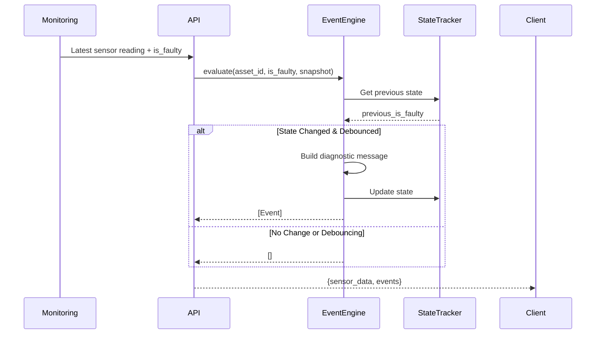

## Overview

The Event Engine provides **transition-based event generation** for the system. Events are emitted ONLY when asset state changes, never for sustained states. This ensures clean event logs and prevents notification spam.

<Note>
  Events are returned as part of the [Sensor History](/api/integration/sensor-history) response, not from a dedicated endpoint.
  
  **Endpoint**: `GET /api/v1/data/history/{asset_id}`
  
  **Response Field**: `events` array
</Note>

## Event Types

### ANOMALY_DETECTED

Emitted when an asset transitions from **healthy** to **faulty** state.

**Trigger**: Sensor readings deviate from baseline by >25% tolerance for 2+ consecutive evaluations.

**Severity**: `critical`

**Example Messages**:
- `"ANOMALY: High vibration variance (mechanical jitter): σ=0.0890g; Vibration transient spike: peak-to-peak=0.310g."`
- `"ANOMALY: Voltage spike detected (245.2V); Current surge detected (22.5A); Power factor degradation (0.78)."`
- `"ANOMALY: Sensor readings have deviated from the established baseline."` (generic fallback)

### ANOMALY_CLEARED

Emitted when an asset transitions from **faulty** to **healthy** state.

**Trigger**: All sensor readings return within baseline tolerance for 2+ consecutive evaluations.

**Severity**: `info`

**Example Message**:
- `"RECOVERY: All sensor readings have returned to within normal operating range."`

### DEGRADATION_WARNING

Emitted when the Degradation Index (DI) crosses threshold milestones: **15%, 30%, 50%, 75%**.

**Trigger**: Cumulative degradation accumulation (Phase 20 prognostics).

**Severity**: 
- `warning` for 15% and 30% thresholds
- `critical` for 50% and 75% thresholds

**Example Messages**:
- `"Motor fatigue reached 15% (DI=0.1523). Remaining Useful Life: 680.2h."`
- `"Motor fatigue reached 50% (DI=0.5012). Remaining Useful Life: 120.5h."`
- `"Motor fatigue reached 75% (DI=0.7534). Remaining Useful Life: 18.3h."`

### HEARTBEAT

*(Reserved for future use - not currently implemented)*

Planned for periodic health check confirmations during extended healthy periods.

## Event Schema

<ResponseField name="timestamp" type="string" required>
  ISO 8601 timestamp when the event occurred.
  
  Example: `"2026-03-02T15:42:30.123456Z"`
</ResponseField>

<ResponseField name="type" type="string" required>
  Event type identifier:
  - `ANOMALY_DETECTED`
  - `ANOMALY_CLEARED`
  - `DEGRADATION_WARNING`
  - `HEARTBEAT` (reserved)
</ResponseField>

<ResponseField name="severity" type="string" required>
  Event severity level:
  - `info` - Normal operational events
  - `warning` - Early warnings requiring attention
  - `critical` - Urgent issues requiring immediate action
</ResponseField>

<ResponseField name="message" type="string" required>
  Plain-English diagnostic explanation of what changed and why.
  
  For `ANOMALY_DETECTED` events, the message includes:
  - **Batch features** (Phase 5): Variance, peak-to-peak ranges, statistical anomalies
  - **Raw signals**: Voltage spikes/drops, current surges, power factor degradation, vibration levels
  - **Limited to top 4 deviations** for readability
</ResponseField>

## Diagnostic Message Components

### Batch Statistical Features (Phase 5)

The Event Engine inspects batch features to identify **WHY** sensors are abnormal:

<ParamField body="vibration_g_std" type="float">
  Vibration variance (mechanical jitter detection)
  
  **Threshold**: `> 0.06` (healthy ≈ 0.02)
  
  **Message**: `"High vibration variance (mechanical jitter): σ=0.0890g"`
</ParamField>

<ParamField body="vibration_g_peak_to_peak" type="float">
  Vibration transient spikes
  
  **Threshold**: `> 0.25` (healthy ≈ 0.10)
  
  **Message**: `"Vibration transient spike: peak-to-peak=0.310g"`
</ParamField>

<ParamField body="voltage_v_std" type="float">
  Voltage variance (grid instability)
  
  **Threshold**: `> 5.0` (healthy ≈ 2.0)
  
  **Message**: `"High voltage variance (grid instability): σ=8.30V"`
</ParamField>

<ParamField body="voltage_v_peak_to_peak" type="float">
  Voltage transient events
  
  **Threshold**: `> 15.0` (healthy ≈ 8.0)
  
  **Message**: `"Voltage transient: peak-to-peak=28.5V"`
</ParamField>

<ParamField body="current_a_std" type="float">
  Current draw instability
  
  **Threshold**: `> 3.0` (healthy ≈ 1.0)
  
  **Message**: `"Current draw instability: σ=4.20A"`
</ParamField>

<ParamField body="power_factor_std" type="float">
  Power factor oscillation (load instability)
  
  **Threshold**: `> 0.04` (healthy ≈ 0.01)
  
  **Message**: `"Power factor oscillating (load instability): σ=0.0450"`
</ParamField>

### Raw Signal Checks

<ParamField body="voltage_v" type="float">
  **Healthy Range**: 220-240V
  
  **Messages**:
  - `"Voltage spike detected (245.2V)"` (> 240V)
  - `"Voltage drop detected (215.3V)"` (< 220V)
</ParamField>

<ParamField body="current_a" type="float">
  **Healthy Range**: 12-18A
  
  **Messages**:
  - `"Current surge detected (22.5A)"` (> 18A)
  - `"Current drop detected (10.2A)"` (< 12A)
</ParamField>

<ParamField body="power_factor" type="float">
  **Healthy Threshold**: ≥ 0.88
  
  **Message**: `"Power factor degradation (0.78)"` (< 0.88)
</ParamField>

<ParamField body="vibration_g" type="float">
  **Healthy Threshold**: ≤ 0.25g
  
  **Message**: `"Vibration spike (0.52g) — possible bearing wear"` (> 0.25g)
</ParamField>

## Debouncing Mechanism

<Info>
  **Phase 7 Enhancement**: Events require **2 consecutive matching evaluations** before confirming a transition.
  
  At 1 evaluation/second, this equals 2 seconds of debouncing.
  
  **Purpose**: Prevent false positives from transient noise or Gaussian fluctuations.
  
  **Example**:
  ```
  t=0s: healthy → faulty (counter: 1/2) → No event
  t=1s: healthy → faulty (counter: 2/2) → ANOMALY_DETECTED emitted
  ```
</Info>

## Event Examples

### Anomaly Detection with Batch Features

```json
{
  "timestamp": "2026-03-02T15:42:30.123456Z",
  "type": "ANOMALY_DETECTED",
  "severity": "critical",
  "message": "ANOMALY: High vibration variance (mechanical jitter): σ=0.0890g; Vibration transient spike: peak-to-peak=0.310g; High voltage variance (grid instability): σ=8.30V; Voltage transient: peak-to-peak=28.5V."
}
```

### Anomaly Detection with Raw Signals

```json
{
  "timestamp": "2026-03-02T16:12:45.987654Z",
  "type": "ANOMALY_DETECTED",
  "severity": "critical",
  "message": "ANOMALY: Voltage spike detected (245.2V); Current surge detected (22.5A); Power factor degradation (0.78); Vibration spike (0.52g) — possible bearing wear."
}
```

### Recovery Event

```json
{
  "timestamp": "2026-03-02T16:20:00.456789Z",
  "type": "ANOMALY_CLEARED",
  "severity": "info",
  "message": "RECOVERY: All sensor readings have returned to within normal operating range."
}
```

### Degradation Threshold Events

```json
[
  {
    "timestamp": "2026-03-02T10:30:15.111111Z",
    "type": "DEGRADATION_WARNING",
    "severity": "warning",
    "message": "Motor fatigue reached 15% (DI=0.1523). Remaining Useful Life: 680.2h."
  },
  {
    "timestamp": "2026-03-02T14:45:30.222222Z",
    "type": "DEGRADATION_WARNING",
    "severity": "warning",
    "message": "Motor fatigue reached 30% (DI=0.3012). Remaining Useful Life: 240.5h."
  },
  {
    "timestamp": "2026-03-02T18:20:50.333333Z",
    "type": "DEGRADATION_WARNING",
    "severity": "critical",
    "message": "Motor fatigue reached 50% (DI=0.5012). Remaining Useful Life: 120.5h."
  }
]
```

## State Tracking

The Event Engine maintains a **thread-safe, per-asset state tracker** (singleton):

```python
class _AssetState:
    previous_is_faulty: Optional[bool]  # None = first run
    last_event_timestamp: Optional[str]
    _consecutive_faulty: int            # Debounce counter
    _consecutive_healthy: int           # Debounce counter
    _last_di_threshold: float           # Last DI threshold emitted
```

**First Call Behavior**:
- Seeds `previous_is_faulty` without emitting an event
- Prevents false positive on system startup

**Subsequent Calls**:
- Compares `is_faulty` against `previous_is_faulty`
- Increments debounce counters
- Emits event only after debounce threshold met

## Integration Workflow



## Event Consumption

### Real-Time Alerts

```javascript
const {events} = await fetch('/api/v1/data/history/Motor-01').then(r => r.json());

events.forEach(event => {
  if (event.severity === 'critical') {
    sendNotification({
      title: event.type,
      body: event.message,
      timestamp: event.timestamp
    });
  }
});
```

### Event Log UI

```javascript
// Filter event history
const criticalEvents = events.filter(e => e.severity === 'critical');
const degradationEvents = events.filter(e => e.type === 'DEGRADATION_WARNING');

// Display in timeline
renderTimeline(events.map(e => ({
  time: new Date(e.timestamp),
  type: e.type,
  severity: e.severity,
  description: e.message
})));
```

### Webhook Integration

```python
import requests

def on_event_received(event):
    if event['severity'] == 'critical':
        requests.post('https://alerts.example.com/webhook', json={
            'asset_id': 'Motor-01',
            'event_type': event['type'],
            'message': event['message'],
            'timestamp': event['timestamp']
        })
```

## Related Endpoints

- [Sensor History](/api/integration/sensor-history) - Primary endpoint that returns events
- [Health Status](/api/integration/health-status) - Get current degradation state and RUL

## Related Documentation

- [Event Engine Architecture](/architecture/event-engine) - Detailed state machine design
- [Phase 5: Batch Features](/architecture/phases#phase-5) - Statistical feature extraction
- [Phase 7: Debouncing](/architecture/phases#phase-7) - False positive suppression
- [Phase 20: Prognostics](/architecture/phases#phase-20) - Cumulative degradation tracking
