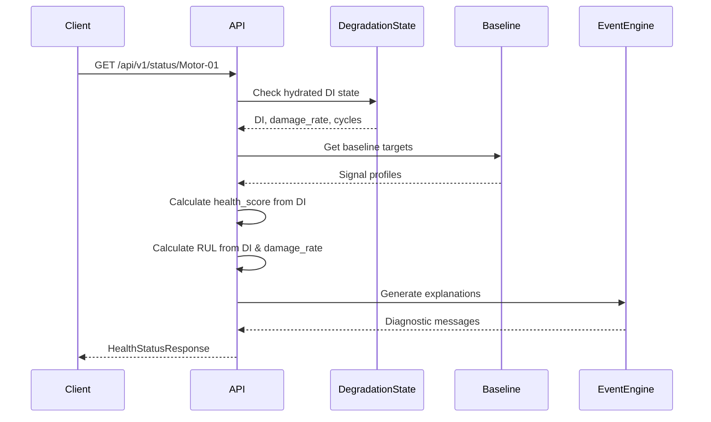

## Overview

This endpoint returns the latest health status for a monitored asset. It uses cumulative degradation tracking (Phase 20) to provide monotonic health degradation with prognostic capabilities.

### Key Features

- **Degradation Index (DI)**: Cumulative wear accumulation from 0.0 (pristine) to 1.0 (end-of-life)
- **Health Score**: Derived from DI, ranges from 0-100 (inverse relationship)
- **Risk Level**: LOW, MODERATE, HIGH, or CRITICAL based on health score
- **RUL Estimation**: Remaining useful life in hours, extrapolated from damage rate
- **Explanations**: Plain-English diagnostic reasons for current health state

## Path Parameters

<ParamField path="asset_id" type="string" required>
  Unique identifier for the asset (e.g., `Motor-01`, `Pump-A3`)
</ParamField>

## Response

<ResponseField name="asset_id" type="string">
  The asset identifier from the request
</ResponseField>

<ResponseField name="timestamp" type="string">
  ISO 8601 timestamp of the health assessment
</ResponseField>

<ResponseField name="health_score" type="integer">
  Current health score (0-100). Higher is healthier.
  - 75-100: LOW risk
  - 50-74: MODERATE risk
  - 25-49: HIGH risk
  - 0-24: CRITICAL risk
</ResponseField>

<ResponseField name="risk_level" type="string">
  Current risk classification: `LOW`, `MODERATE`, `HIGH`, or `CRITICAL`
</ResponseField>

<ResponseField name="maintenance_window_days" type="float">
  Recommended maintenance window in days. Calculated from RUL or scaled by remaining health percentage.
</ResponseField>

<ResponseField name="explanations" type="array">
  Array of plain-English diagnostic messages explaining the current health state.
  
  Example: `["Voltage readings within normal range (230.0V)", "Current draw stable at 15.2A"]`
</ResponseField>

<ResponseField name="model_version" type="string">
  Model identifier including degradation index and cycle count.
  
  Format: `cumulative-di:{DI_VALUE}|cycles:{CYCLE_COUNT}`
  
  Example: `cumulative-di:0.0234|cycles:142`
</ResponseField>

<ResponseField name="baseline_targets" type="object">
  Baseline reference values for each monitored signal.
  
  ```json
  {
    "voltage_v": 230.5,
    "current_a": 15.2,
    "power_factor": 0.95,
    "vibration_g": 0.02
  }
  ```
</ResponseField>

<ResponseField name="degradation_index" type="float" optional>
  Cumulative degradation index (0.0 to 1.0). Only present when DI state is hydrated.
  
  - 0.0: Pristine condition
  - 0.15: 15% degradation threshold
  - 0.30: 30% degradation threshold
  - 0.50: 50% degradation threshold (critical)
  - 0.75: 75% degradation threshold (critical)
  - 1.0: End of useful life
</ResponseField>

<ResponseField name="rul_hours" type="float" optional>
  Remaining Useful Life in hours. Only present when DI state is hydrated.
  
  Returns `99999.0` when no active fault is present (infinite RUL).
</ResponseField>

## Example Request

```bash
curl -X GET "http://localhost:8000/api/v1/status/Motor-01"
```

## Example Response

### Healthy Asset (Low Risk)

```json
{
  "asset_id": "Motor-01",
  "timestamp": "2026-03-02T14:30:00.123456Z",
  "health_score": 92,
  "risk_level": "LOW",
  "maintenance_window_days": 90.0,
  "explanations": [
    "Voltage readings within normal range (230.5V)",
    "Current draw stable at 15.2A",
    "Power factor excellent at 0.95",
    "Vibration levels nominal (0.02g)"
  ],
  "model_version": "cumulative-di:0.0234|cycles:142",
  "baseline_targets": {
    "voltage_v": 230.5,
    "current_a": 15.2,
    "power_factor": 0.95,
    "vibration_g": 0.02
  },
  "degradation_index": 0.0234,
  "rul_hours": 99999.0
}
```

### Degraded Asset (High Risk)

```json
{
  "asset_id": "Motor-01",
  "timestamp": "2026-03-02T18:45:00.987654Z",
  "health_score": 35,
  "risk_level": "HIGH",
  "maintenance_window_days": 7.2,
  "explanations": [
    "Vibration spike (0.45g) — possible bearing wear",
    "Power factor degradation (0.82)",
    "Current surge detected (22.3A)"
  ],
  "model_version": "cumulative-di:0.4521|cycles:847",
  "baseline_targets": {
    "voltage_v": 230.5,
    "current_a": 15.2,
    "power_factor": 0.95,
    "vibration_g": 0.02
  },
  "degradation_index": 0.4521,
  "rul_hours": 172.8
}
```

### Asset Without Baseline

```json
{
  "asset_id": "Motor-02",
  "timestamp": "2026-03-02T10:00:00.000000Z",
  "health_score": 85,
  "risk_level": "LOW",
  "maintenance_window_days": 30.0,
  "explanations": [
    "Baseline not yet established. Collecting data..."
  ],
  "model_version": "pending"
}
```

## Error Responses

### Asset Not Found

```json
{
  "detail": "No data for asset 'Motor-99'"
}
```

**HTTP Status**: 404 Not Found

## State Dependencies

<Info>
  This endpoint requires:
  1. Sensor data history for the asset (from `/api/v1/data/simple` ingestion)
  2. A trained baseline model (from `/api/v1/baseline/build`)
  3. Degradation state hydration (automatic on first access)
  
  Without a baseline, the endpoint returns default healthy values with "pending" status.
</Info>

## Integration Workflow



## Related Endpoints

- [Build Baseline](/api/integration/baseline) - Create baseline model before calling this endpoint
- [Sensor History](/api/integration/sensor-history) - View raw sensor data used for health calculation
- [Events](/api/integration/events) - View state transition events (anomaly detection/clearing)
