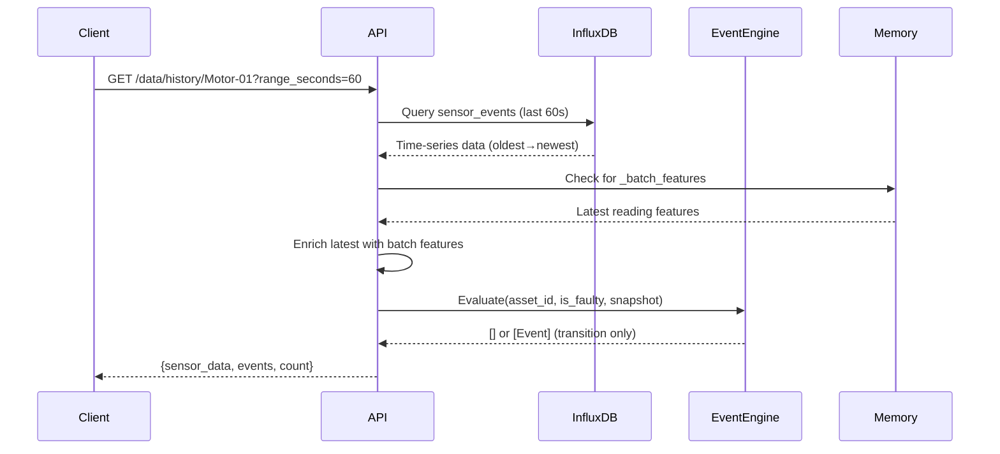

## Overview

This endpoint queries InfluxDB for recent sensor readings and evaluates the latest data point for state transitions. It serves as the **Single Source of Truth** for time-series data in the system.

### Key Features

- **Time-Range Queries**: Retrieve sensor data within a configurable time window (10-3600 seconds)
- **Event Detection**: Automatically evaluates latest reading for anomaly transitions
- **Chronological Ordering**: Returns data sorted oldest-first for correct chart rendering
- **Feature Enrichment**: Includes batch statistical features when available

## Path Parameters

<ParamField path="asset_id" type="string" required>
  Unique identifier for the asset (e.g., `Motor-01`, `Pump-A3`)
</ParamField>

## Query Parameters

<ParamField query="limit" type="integer" default="100">
  Maximum number of data points to return. Range: 1-1000.
  
  Use lower values for real-time dashboards, higher values for historical analysis.
</ParamField>

<ParamField query="range_seconds" type="integer" default="60">
  Time range in seconds to query backwards from now. Range: 10-3600.
  
  Examples:
  - `60` = Last 1 minute
  - `300` = Last 5 minutes
  - `3600` = Last 1 hour
</ParamField>

## Response

<ResponseField name="asset_id" type="string">
  The asset identifier from the request
</ResponseField>

<ResponseField name="sensor_data" type="array">
  Array of sensor readings sorted chronologically (oldest first).
  
  Each reading contains:
  
  <Expandable title="Sensor Reading Object">
    <ResponseField name="timestamp" type="string">
      ISO 8601 timestamp of the reading
    </ResponseField>
    
    <ResponseField name="voltage_v" type="float">
      Voltage reading in Volts
    </ResponseField>
    
    <ResponseField name="current_a" type="float">
      Current reading in Amperes
    </ResponseField>
    
    <ResponseField name="power_factor" type="float">
      Power factor (0.0-1.0)
    </ResponseField>
    
    <ResponseField name="vibration_g" type="float">
      Vibration intensity in g-force
    </ResponseField>
    
    <ResponseField name="is_faulty" type="boolean">
      Whether this reading was flagged as anomalous.
      
      Set to `true` when sensor values deviate from baseline by >25% tolerance.
    </ResponseField>
    
    <ResponseField name="_batch_features" type="object" optional>
      Batch statistical features computed over the last N readings (Phase 5).
      
      Only present on the most recent reading when monitoring loops are active.
      
      ```json
      {
        "voltage_v_std": 2.3,
        "voltage_v_peak_to_peak": 8.5,
        "current_a_std": 1.1,
        "current_a_peak_to_peak": 4.2,
        "power_factor_std": 0.012,
        "vibration_g_std": 0.023,
        "vibration_g_peak_to_peak": 0.09
      }
      ```
    </ResponseField>
  </Expandable>
</ResponseField>

<ResponseField name="events" type="array">
  Array of state transition events detected from the latest reading.
  
  Events are emitted ONLY on transitions (healthy→faulty or faulty→healthy), never for sustained states.
  
  <Expandable title="Event Object">
    <ResponseField name="timestamp" type="string">
      ISO 8601 timestamp of the event
    </ResponseField>
    
    <ResponseField name="type" type="string">
      Event type:
      - `ANOMALY_DETECTED` - Transition from healthy to faulty
      - `ANOMALY_CLEARED` - Transition from faulty to healthy
      - `DEGRADATION_WARNING` - Degradation index crossed threshold
      - `HEARTBEAT` - Periodic health check (reserved)
    </ResponseField>
    
    <ResponseField name="severity" type="string">
      Event severity:
      - `info` - Normal operational events (ANOMALY_CLEARED)
      - `warning` - Early degradation warnings (15%, 30% thresholds)
      - `critical` - Urgent attention required (ANOMALY_DETECTED, 50%+ thresholds)
    </ResponseField>
    
    <ResponseField name="message" type="string">
      Plain-English diagnostic explanation of the event.
      
      Examples:
      - `"ANOMALY: Vibration spike (0.45g) — possible bearing wear; Power factor degradation (0.82)."`
      - `"RECOVERY: All sensor readings have returned to within normal operating range."`
      - `"Motor fatigue reached 30% (DI=0.3012). Remaining Useful Life: 240.5h."`
    </ResponseField>
  </Expandable>
</ResponseField>

<ResponseField name="count" type="integer">
  Number of sensor readings returned (length of `sensor_data` array)
</ResponseField>

## Example Request

```bash
curl -X GET "http://localhost:8000/api/v1/data/history/Motor-01?limit=50&range_seconds=300"
```

## Example Response

### Normal Operation (No Events)

```json
{
  "asset_id": "Motor-01",
  "sensor_data": [
    {
      "timestamp": "2026-03-02T14:25:00.000000Z",
      "voltage_v": 230.2,
      "current_a": 15.1,
      "power_factor": 0.95,
      "vibration_g": 0.02,
      "is_faulty": false
    },
    {
      "timestamp": "2026-03-02T14:25:01.000000Z",
      "voltage_v": 230.5,
      "current_a": 15.3,
      "power_factor": 0.94,
      "vibration_g": 0.02,
      "is_faulty": false
    },
    {
      "timestamp": "2026-03-02T14:25:02.000000Z",
      "voltage_v": 230.1,
      "current_a": 15.0,
      "power_factor": 0.95,
      "vibration_g": 0.03,
      "is_faulty": false,
      "_batch_features": {
        "voltage_v_std": 2.1,
        "voltage_v_peak_to_peak": 7.8,
        "current_a_std": 1.0,
        "current_a_peak_to_peak": 3.9,
        "power_factor_std": 0.009,
        "vibration_g_std": 0.018,
        "vibration_g_peak_to_peak": 0.08
      }
    }
  ],
  "events": [],
  "count": 3
}
```

### Anomaly Detection Event

```json
{
  "asset_id": "Motor-01",
  "sensor_data": [
    {
      "timestamp": "2026-03-02T15:42:30.000000Z",
      "voltage_v": 245.2,
      "current_a": 22.5,
      "power_factor": 0.78,
      "vibration_g": 0.52,
      "is_faulty": true,
      "_batch_features": {
        "voltage_v_std": 8.3,
        "voltage_v_peak_to_peak": 28.5,
        "current_a_std": 4.2,
        "current_a_peak_to_peak": 15.1,
        "power_factor_std": 0.045,
        "vibration_g_std": 0.089,
        "vibration_g_peak_to_peak": 0.31
      }
    }
  ],
  "events": [
    {
      "timestamp": "2026-03-02T15:42:30.000000Z",
      "type": "ANOMALY_DETECTED",
      "severity": "critical",
      "message": "ANOMALY: High vibration variance (mechanical jitter): σ=0.0890g; Vibration transient spike: peak-to-peak=0.310g; High voltage variance (grid instability): σ=8.30V."
    }
  ],
  "count": 1
}
```

### Recovery Event

```json
{
  "asset_id": "Motor-01",
  "sensor_data": [
    {
      "timestamp": "2026-03-02T15:50:15.000000Z",
      "voltage_v": 230.3,
      "current_a": 15.2,
      "power_factor": 0.94,
      "vibration_g": 0.02,
      "is_faulty": false
    }
  ],
  "events": [
    {
      "timestamp": "2026-03-02T15:50:15.000000Z",
      "type": "ANOMALY_CLEARED",
      "severity": "info",
      "message": "RECOVERY: All sensor readings have returned to within normal operating range."
    }
  ],
  "count": 1
}
```

## Event Engine Behavior

<Info>
  **Core Architectural Rule**: Events are transitions, NOT states.
  
  The Event Engine maintains per-asset state tracking and emits events ONLY when `is_faulty` changes:
  - `healthy → faulty` → Emits `ANOMALY_DETECTED` (critical)
  - `faulty → healthy` → Emits `ANOMALY_CLEARED` (info)
  - `same state` → No event emitted
  
  **Debouncing**: Requires 2 consecutive matching evaluations before confirming a transition to prevent false positives from transient noise.
</Info>

## Data Persistence

<Note>
  This endpoint queries **InfluxDB directly** as the Single Source of Truth for time-series data.
  
  In-memory `_sensor_history` is used only for:
  - Feature enrichment (`_batch_features`)
  - Fast recent-data access in monitoring loops
  
  All persistent queries should use this endpoint, not in-memory storage.
</Note>

## Integration Workflow



## Use Cases

### Real-Time Dashboard Charts

```javascript
// Poll every 1 second for last 60 seconds of data
setInterval(async () => {
  const response = await fetch(
    '/api/v1/data/history/Motor-01?range_seconds=60&limit=60'
  );
  const {sensor_data, events} = await response.json();
  
  updateChart(sensor_data);
  
  if (events.length > 0) {
    showAlert(events[0]);
  }
}, 1000);
```

### Historical Analysis

```bash
# Get last hour of data for analysis
curl -X GET "http://localhost:8000/api/v1/data/history/Motor-01?limit=1000&range_seconds=3600" \
  | jq '.sensor_data[] | select(.is_faulty == true)'
```

## Related Endpoints

- [Health Status](/api/integration/health-status) - Get aggregated health metrics derived from this data
- [Events](/api/integration/events) - Dedicated events documentation
- [Simple Ingest](/api/integration/ingest) - Write sensor data that this endpoint reads
