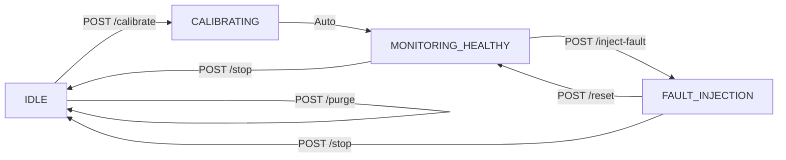

## Overview

Returns the current system lifecycle state along with validation metrics and fault injection parameters. Use this endpoint to monitor system transitions and track model performance during calibration and fault injection phases.

## Endpoint

```
GET /system/state
```

## System States

The system operates in one of four states:

| State | Description |
|-------|-------------|
| `IDLE` | System ready. Click 'Calibrate' to begin. |
| `CALIBRATING` | Generating healthy data, building baseline, training ML models. |
| `MONITORING_HEALTHY` | Calibration complete. Monitoring healthy operation with batch-feature detection. |
| `FAULT_INJECTION` | Injecting faulty sensor data with specified fault type and severity. |

## Response

<ResponseField name="state" type="string" required>
  Current system state enum: `IDLE`, `CALIBRATING`, `MONITORING_HEALTHY`, or `FAULT_INJECTION`
</ResponseField>

<ResponseField name="message" type="string" required>
  Human-readable status message describing current operation
</ResponseField>

<ResponseField name="started_at" type="datetime" required={false}>
  ISO 8601 timestamp when current state was entered (UTC)
</ResponseField>

<ResponseField name="fault_type" type="string" required={false}>
  Active fault type during `FAULT_INJECTION` state: `SPIKE`, `DRIFT`, `JITTER`, or `DEFAULT`
</ResponseField>

<ResponseField name="fault_severity" type="string" required={false}>
  Active fault severity: `MILD`, `MEDIUM`, or `SEVERE`
</ResponseField>

<ResponseField name="training_samples" type="integer" required>
  Number of samples used for baseline training (1000 during calibration)
</ResponseField>

<ResponseField name="healthy_stability" type="float" required>
  Percentage of healthy points classified as LOW risk (target: ≥95%)
</ResponseField>

<ResponseField name="fault_capture_rate" type="float" required>
  Percentage of faulty points classified as HIGH+ risk (target: ≥90%)
</ResponseField>

## Example Request

```bash cURL
curl https://predictive-maintenance-uhlb.onrender.com/system/state
```

```python Python
import requests

response = requests.get(
    "https://predictive-maintenance-uhlb.onrender.com/system/state"
)

data = response.json()
print(f"System State: {data['state']}")
print(f"Message: {data['message']}")
```

## Example Response

<CodeGroup>
```json IDLE State
{
  "state": "IDLE",
  "message": "System ready. Click 'Calibrate' to begin.",
  "started_at": null,
  "fault_type": null,
  "fault_severity": null,
  "training_samples": 0,
  "healthy_stability": 100.0,
  "fault_capture_rate": 100.0
}
```

```json CALIBRATING State
{
  "state": "CALIBRATING",
  "message": "Building baseline profile from 1,000 samples...",
  "started_at": "2026-03-02T14:30:00Z",
  "fault_type": null,
  "fault_severity": null,
  "training_samples": 1000,
  "healthy_stability": 97.3,
  "fault_capture_rate": 100.0
}
```

```json FAULT_INJECTION State
{
  "state": "FAULT_INJECTION",
  "message": "Injecting SEVERE JITTER fault...",
  "started_at": "2026-03-02T14:35:22Z",
  "fault_type": "JITTER",
  "fault_severity": "SEVERE",
  "training_samples": 1000,
  "healthy_stability": 96.8,
  "fault_capture_rate": 94.2
}
```
</CodeGroup>

## Validation Metrics

### Healthy Stability

Measures the **false positive rate** during healthy monitoring:

```python
healthy_stability = (healthy_correct / healthy_total) * 100
# healthy_correct = count of healthy points classified as LOW risk
```

**Interpretation:**
- ≥95%: Excellent baseline (low false alarms)
- 85-94%: Acceptable (minor noise)
- {"<"}85%: Baseline needs recalibration

### Fault Capture Rate

Measures the **true positive rate** during fault injection:

```python
fault_capture_rate = (faulty_correct / faulty_total) * 100
# faulty_correct = count of faulty points classified as HIGH+ risk
```

**Interpretation:**
- ≥90%: Strong anomaly detection
- 70-89%: Moderate detection (consider severity tuning)
- {"<"}70%: Weak detection (model may need retraining)

## State Transitions

The system follows this lifecycle:



## Use Cases

<CardGroup cols={2}>
  <Card title="Dashboard Polling" icon="chart-line">
    Poll every 1-2 seconds to update UI state indicators and progress messages
  </Card>
  
  <Card title="Model Validation" icon="clipboard-check">
    Monitor `healthy_stability` and `fault_capture_rate` to verify baseline quality
  </Card>
  
  <Card title="Automation Scripts" icon="robot">
    Check state before triggering calibration or fault injection workflows
  </Card>
  
  <Card title="Debugging" icon="bug">
    Inspect `message` field for detailed status during long-running operations
  </Card>
</CardGroup>

## Error Responses

This endpoint does not return errors under normal operation. It always returns the current system state.

## Related Endpoints

- [POST /system/calibrate](/api/system/calibrate) - Start baseline calibration
- [POST /system/inject-fault](/api/system/inject-fault) - Inject faults for testing
- [POST /system/purge](/api/system/purge) - Deep system reset
