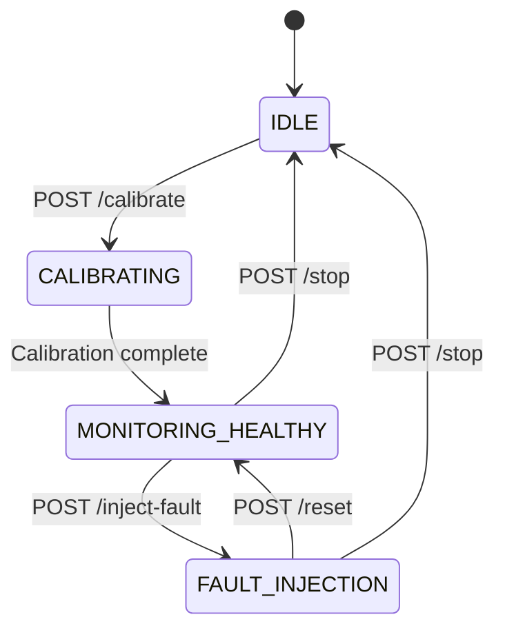

## POST /system/stop

Stop the current monitoring session and return to IDLE state. This allows recalibration without restarting the server.

### Response

<ResponseField name="status" type="string">
  Action status: `stopped`
</ResponseField>

<ResponseField name="message" type="string">
  Human-readable status message
</ResponseField>

<ResponseField name="state" type="string">
  New system state: `IDLE`
</ResponseField>

### Example

```bash cURL
curl -X POST "https://predictive-maintenance-uhlb.onrender.com/system/stop"
```

```json Response
{
  "status": "stopped",
  "message": "Session stopped. System is now IDLE.",
  "state": "IDLE"
}
```

### Behavior

When you call `/system/stop`:

1. **Stops background thread** - Terminates calibration, monitoring, or fault injection
2. **Transitions to IDLE** - System returns to initial state
3. **Resets metrics** - Clears training samples and validation metrics
4. **Preserves data** - Sensor history and models remain in memory
5. **Allows recalibration** - You can now call `/system/calibrate` again

<Info>
  **Non-Destructive**: `/stop` does NOT clear sensor data, baselines, or models. It only stops the active monitoring session. Use `/system/purge` for a complete reset.
</Info>

### State Requirements

| Current State | Can Stop? |
|--------------|-----------|
| `IDLE` | ❌ No (already idle) |
| `CALIBRATING` | ❌ No (must complete) |
| `MONITORING_HEALTHY` | ✅ Yes |
| `FAULT_INJECTION` | ✅ Yes |

<Warning>
  You cannot stop during calibration. Wait for calibration to complete first, then call `/stop`.
</Warning>

### Status Codes

- `200` - Session stopped successfully
- `400` - Invalid state (already IDLE or calibrating)

### Use Cases

<CardGroup cols={2}>
  <Card title="Session Management" icon="circle-pause">
    End the current demo session cleanly
  </Card>
  <Card title="Recalibration" icon="rotate">
    Prepare for a new calibration run
  </Card>
  <Card title="Testing Workflows" icon="vial">
    Reset between test scenarios
  </Card>
  <Card title="Dashboard Control" icon="gamepad">
    Stop button in the dashboard UI
  </Card>
</CardGroup>

### State Transition Diagram



### Comparison with Other Endpoints

| Endpoint | Stops Monitoring? | Resets DI? | Returns to State | Clears Data? |
|----------|------------------|-----------|------------------|--------------|
| `/system/stop` | ✅ Yes | ❌ No | `IDLE` | ❌ No |
| `/system/reset` | ✅ Yes | ❌ No | `MONITORING_HEALTHY` | ❌ No |
| `/system/purge` | ✅ Yes | ✅ Yes | `IDLE` | ✅ Yes |

Use `/stop` when you want to end the current session but keep data for analysis or reuse.

### Related Endpoints

<CardGroup cols={2}>
  <Card title="Calibrate" icon="gauge" href="/api/system/calibrate">
    Start a new calibration session
  </Card>
  <Card title="Reset" icon="arrows-rotate" href="/api/system/reset">
    Return to healthy monitoring
  </Card>
  <Card title="Purge" icon="trash" href="/api/system/purge">
    Complete system reset
  </Card>
  <Card title="System State" icon="circle-info" href="/api/system/state">
    Check current state
  </Card>
</CardGroup>
