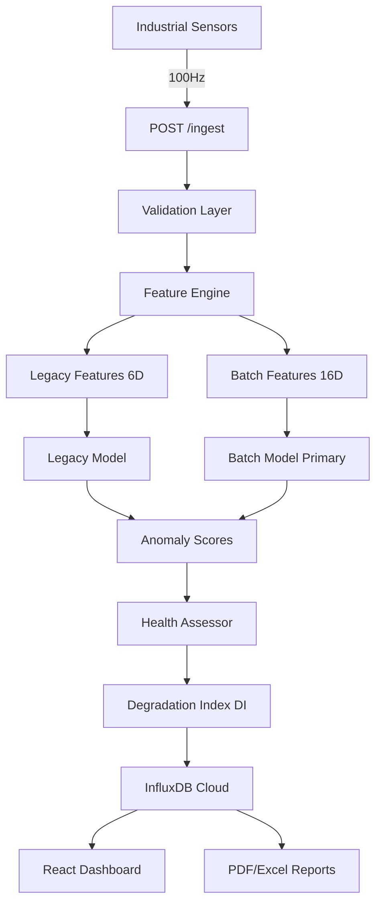

# System Architecture

Understand how the Predictive Maintenance System processes sensor data through a dual-model ML pipeline to predict equipment failures.

## Deployment Stack

The system is built on a modern, cloud-native stack optimized for real-time data processing:

| Component | Technology | Hosting | URL |
|-----------|------------|---------|-----|
| **Frontend** | React 18 + Vite | Vercel | [predictive-maintenance-ten.vercel.app](https://predictive-maintenance-ten.vercel.app/) |
| **Backend** | FastAPI + Docker | Render | [predictive-maintenance-uhlb.onrender.com](https://predictive-maintenance-uhlb.onrender.com) |
| **Database** | InfluxDB 2.x | InfluxDB Cloud | AWS us-east-1 |

## High-Level Architecture

```
┌────────────────────────────────────────────────────────────────┐
│                   Frontend (React + Vite)                      │
│                      🌐 Vercel                                 │
│  ┌──────────┐ ┌──────────┐ ┌──────────┐ ┌──────────────────┐  │
│  │ Metrics  │ │  Chart   │ │  Health  │ │  Explanations    │  │
│  │  Cards   │ │ Recharts │ │  Summary │ │     Panel        │  │
│  └──────────┘ └──────────┘ └──────────┘ └──────────────────┘  │
└────────────────────────────┬───────────────────────────────────┘
                             │ HTTPS/JSON (Vercel Rewrites)
┌────────────────────────────▼───────────────────────────────────┐
│                   Backend (FastAPI + Docker)                   │
│                      🚀 Render                                 │
│  ┌──────────────┐ ┌──────────────┐ ┌──────────────────────┐   │
│  │   Ingest     │ │   Features   │ │    ML Pipeline       │   │
│  │   /ingest    │ │   Engine     │ │  Baseline → Detector │   │
│  └──────────────┘ └──────────────┘ └──────────────────────┘   │
│  ┌──────────────┐ ┌──────────────┐ ┌──────────────────────┐   │
│  │   Health     │ │  Explainer   │ │    Report            │   │
│  │   Assessor   │ │   Engine     │ │    Generator         │   │
│  └──────────────┘ └──────────────┘ └──────────────────────┘   │
└────────────────────────────┬───────────────────────────────────┘
                             │
┌────────────────────────────▼───────────────────────────────────┐
│                 InfluxDB Cloud (Time-Series)                   │
│              sensor_data • features • anomalies                │
└────────────────────────────────────────────────────────────────┘
```

## Frontend (React + Vercel)

### Technology Stack

<CardGroup cols={2}>
  <Card title="React 18" icon="react">
    Component-based UI with hooks for state management
  </Card>
  <Card title="Recharts" icon="chart-line">
    Real-time data visualization with 60s sliding windows
  </Card>
  <Card title="Vite" icon="bolt">
    Lightning-fast build tool and dev server
  </Card>
  <Card title="Vercel" icon="cloud">
    Global CDN deployment with automatic HTTPS
  </Card>
</CardGroup>

### Key Features

- **Real-time Charts**: Multi-signal streaming with Voltage (V), Current (A), Vibration (g)
- **Fixed Y-Axis Domains**: 60s right-anchored sliding window for temporal stability
- **Anomaly Visualization**: Red shaded regions when risk ≠ LOW
- **Health Score Ring**: Color-coded 0-100 gauge (Green → Yellow → Orange → Red)
- **Glassmorphism UI**: Dark theme with translucent cards and backdrop blur
- **Keep-Alive Heartbeat**: 10-minute `/ping` to prevent Render free-tier cold starts

### Component Architecture

```
┌─────────────────────────────────────────────────────────────┐
│  App.jsx                                                     │
│  ├── Header                   (System status badge)          │
│  ├── SystemControlPanel       (Calibrate, Fault Injection)   │
│  ├── MetricCard × 4           (Voltage, Current, PF, Vib)    │
│  ├── SignalChart              (Recharts multi-line)          │
│  ├── HealthSummary            (Score ring, RUL, Risk badge)  │
│  ├── InsightPanel             (Explainability text)          │
│  ├── OperatorLog              (Maintenance event logging)    │
│  └── LogWatcher               (Real-time event feed)         │
└─────────────────────────────────────────────────────────────┘
```

## Backend (FastAPI + Render)

### Technology Stack

<CardGroup cols={3}>
  <Card title="Python 3.11+" icon="python">
    Core runtime with type hints
  </Card>
  <Card title="FastAPI" icon="bolt">
    Async REST API with OpenAPI docs
  </Card>
  <Card title="Pydantic" icon="shield-check">
    Schema validation and settings
  </Card>
  <Card title="scikit-learn" icon="brain">
    Isolation Forest ML models
  </Card>
  <Card title="ReportLab" icon="file-pdf">
    PDF report generation
  </Card>
  <Card title="Docker" icon="docker">
    Containerized deployment
  </Card>
</CardGroup>

### Data Processing Pipeline

The backend processes sensor data through six stages:

<Steps>
  <Step title="Ingestion & Validation">
    **Endpoint**: `POST /ingest`

    ```python
    # backend/api/routes.py
    @router.post("/ingest")
    async def ingest_sensor_data(event: SensorEvent):
        # Pydantic schema enforcement
        # UTC timestamp normalization
        # Derived signal: power_kw = V × I × PF / 1000
    ```

    <Info>
      All sensor data is validated against strict Pydantic schemas before processing.
    </Info>
  </Step>

  <Step title="Feature Engineering">
    **Module**: `backend/features/calculator.py`

    The system computes **two feature sets**:

    **Legacy Features (1Hz, 6 dimensions)**:
    - `voltage_rolling_mean_1h`: Mean voltage over 1 hour
    - `current_spike_count`: Points > 3σ from local mean
    - `power_factor_efficiency_score`: (PF - 0.8) / 0.2 × 100
    - `vibration_intensity_rms`: √(mean(vibration²))
    - `voltage_stability`: |V - 230.0|
    - `power_vibration_ratio`: vibration / (PF + 0.01)

    **Batch Features (100Hz windows, 16 dimensions)**:
    - For each signal (voltage, current, power_factor, vibration):
      - `mean`, `std`, `peak_to_peak`, `rms`
    - 4 signals × 4 stats = **16 features**

    <Note>
      The batch model achieves 99.6% F1-score by explicitly capturing variance—critical for detecting "Jitter" faults where averages look normal but standard deviation spikes.
    </Note>
  </Step>

  <Step title="ML Inference (Dual Models)">
    **Modules**: 
    - `backend/ml/detector.py` (Legacy)
    - `backend/ml/batch_detector.py` (Batch)

    Both models are **Isolation Forest** classifiers:

    ```python
    from sklearn.ensemble import IsolationForest

    # Trained during calibration on healthy data
    model = IsolationForest(
        contamination=0.05,  # 5% expected anomaly rate
        random_state=42,
        n_estimators=100
    )
    ```

    **Output**: Anomaly score (0.0 = healthy, 1.0 = critical)
  </Step>

  <Step title="Health Assessment & Degradation Tracking">
    **Module**: `backend/rules/assessor.py`

    The system maintains a **Cumulative Degradation Index (DI)**:

    ```python
    # Dead-zone: healthy noise produces zero damage
    HEALTHY_FLOOR = 0.65
    if batch_score < HEALTHY_FLOOR:
        effective_severity = 0.0
    else:
        effective_severity = (batch_score - HEALTHY_FLOOR) / (1.0 - HEALTHY_FLOOR)

    # Cumulative damage increment
    SENSITIVITY_CONSTANT = 0.005
    DI_increment = (effective_severity ** 2) * SENSITIVITY_CONSTANT * dt
    DI = min(DI + DI_increment, 1.0)  # monotonic, capped at 1.0

    # Health & RUL derived from DI
    health_score = round(100 * (1.0 - DI))
    RUL_hours = (1.0 - DI) / max(damage_rate, 1e-9)
    ```

    **Risk Classification**:

    | Health Score | Risk Level | Color | Typical RUL |
    |--------------|------------|-------|-------------|
    | 75-100 | LOW | Green | 30-60 days |
    | 50-74 | MODERATE | Yellow | 10-29 days |
    | 25-49 | HIGH | Orange | 1-9 days |
    | 0-24 | CRITICAL | Red | < 1 day |
  </Step>

  <Step title="Explainability Engine">
    **Module**: `backend/rules/explainer.py`

    Generates human-readable explanations:

    ```python
    # Example outputs:
    "High vibration variance: σ=0.17g (5x normal baseline)"
    "Voltage spike detected: 3.2σ above rolling mean"
    "Power factor degradation: 0.78 (target: 0.92)"
    ```

    <Info>
      Every alert includes natural language explanations so operators understand **why** the system flagged an issue.
    </Info>
  </Step>

  <Step title="Persistence & Reporting">
    **Storage**: InfluxDB Cloud
    - `sensor_data`: Raw 100Hz measurements
    - `features`: Computed 1Hz and batch features
    - `health_reports`: DI, health scores, risk levels

    **Reports**:
    - **Executive PDF** (1-page): Health grade, DI%, RUL for plant managers
    - **Multi-sheet Excel**: Summary, operator logs, raw sensor data for analysts
    - **Industrial Certificate** (5-page): Feature contributions, ROI analysis, audit trail for engineers
  </Step>
</Steps>

## Database (InfluxDB Cloud)

### Why InfluxDB?

<CardGroup cols={2}>
  <Card title="Time-Series Optimized" icon="clock">
    Purpose-built for sensor data with millisecond precision
  </Card>
  <Card title="Flux Query Language" icon="code">
    Powerful aggregation and windowing functions
  </Card>
  <Card title="Data Retention Policies" icon="database">
    Automatic downsampling and archival
  </Card>
  <Card title="Cloud-Native" icon="cloud">
    Managed service with automatic backups
  </Card>
</CardGroup>

### Data Model

```
┌─────────────────────────────────────────────────────────────┐
│  MEASUREMENT: sensor_data                                    │
│  ├── TAGS                                                    │
│  │   ├── asset_id: "Motor-01"                               │
│  │   └── location: "Plant-A"                                │
│  ├── FIELDS                                                  │
│  │   ├── voltage_v: 230.5                                    │
│  │   ├── current_a: 12.3                                     │
│  │   ├── power_factor: 0.92                                  │
│  │   ├── vibration_g: 0.15                                   │
│  │   └── power_kw: 2.61 (derived)                            │
│  └── TIMESTAMP: 2026-03-02T12:34:56.789Z                     │
└─────────────────────────────────────────────────────────────┘

┌─────────────────────────────────────────────────────────────┐
│  MEASUREMENT: health_reports                                 │
│  ├── TAGS                                                    │
│  │   ├── asset_id: "Motor-01"                               │
│  │   └── risk_level: "MODERATE"                             │
│  ├── FIELDS                                                  │
│  │   ├── health_score: 68.0                                  │
│  │   ├── degradation_index: 0.32                             │
│  │   ├── damage_rate: 0.0012                                 │
│  │   ├── rul_hours: 266.67                                   │
│  │   ├── batch_score: 0.78                                   │
│  │   └── legacy_score: 0.45                                  │
│  └── TIMESTAMP: 2026-03-02T12:34:56.789Z                     │
└─────────────────────────────────────────────────────────────┘
```

## ML Pipeline Deep Dive

### Dual-Model Architecture

The system runs **two Isolation Forest models** in parallel:

<Tabs>
  <Tab title="Legacy Model (v2)">
    **Input**: 1Hz aggregated features (6 dimensions)

    **Features**:
    1. `voltage_rolling_mean_1h`
    2. `current_spike_count`
    3. `power_factor_efficiency_score`
    4. `vibration_intensity_rms`
    5. `voltage_stability`
    6. `power_vibration_ratio`

    **Performance**:
    - Precision: 64.1%
    - Recall: 100.0%
    - F1-Score: 78.1%
    - **Limitation**: Cannot detect variance-only faults (Jitter)

    **Use Case**: Backward compatibility, fast inference ({"<"}50ms)
  </Tab>

  <Tab title="Batch Model (v3)">
    **Input**: 100Hz windows reduced to 16-D feature vectors

    **Features** (4 signals × 4 statistics):
    - Voltage: `mean`, `std`, `peak_to_peak`, `rms`
    - Current: `mean`, `std`, `peak_to_peak`, `rms`
    - Power Factor: `mean`, `std`, `peak_to_peak`, `rms`
    - Vibration: `mean`, `std`, `peak_to_peak`, `rms`

    **Performance**:
    - Precision: **99.2%**
    - Recall: **100.0%**
    - F1-Score: **99.6%**
    - **Advantage**: Detects Jitter faults (normal mean, high variance)

    **Use Case**: Primary inference model, production deployment

    <Note>
      A "Jitter Fault" where average vibration is 0.15g (normal) but σ=0.17g (5x healthy) is **invisible** to 1Hz models. The batch model catches it because `std` is an explicit feature.
    </Note>
  </Tab>
</Tabs>

### Training Workflow

<Steps>
  <Step title="Calibration Request">
    ```bash
    POST /system/calibrate
    {
      "asset_id": "Motor-01",
      "duration_seconds": 60,
      "sampling_rate_hz": 100
    }
    ```
  </Step>

  <Step title="Healthy Data Generation">
    The system generates synthetic sensor data matching real-world patterns:
    - Voltage: 230V ± 5% (Indian grid)
    - Current: 10-15A with power factor coupling
    - Vibration: 0.05-0.20g with white noise
  </Step>

  <Step title="Feature Extraction">
    - **1Hz features**: Computed from rolling windows
    - **Batch features**: 100-point windows reduced to 16-D vectors
  </Step>

  <Step title="Model Training">
    ```python
    # Both models use IsolationForest
    from sklearn.ensemble import IsolationForest

    model = IsolationForest(
        contamination=0.05,
        random_state=42,
        n_estimators=100
    )
    model.fit(healthy_features)
    ```
  </Step>

  <Step title="Baseline Persistence">
    Trained models and baseline statistics are saved:
    - `backend/models/isolation_forest_model.pkl` (Legacy)
    - `backend/models/batch_isolation_forest.pkl` (Batch)
    - Baseline targets written to InfluxDB for dashboard display
  </Step>
</Steps>

### Fault Detection Types

The system detects four fault types:

<AccordionGroup>
  <Accordion title="SPIKE - Voltage/Current Surges">
    **Pattern**: Sharp transients in electrical signals

    **Example**:
    - Voltage: 230V → 280V (21% spike)
    - Current: 12A → 45A (375% surge)

    **Detection**: Both models detect via `peak_to_peak` and spike count features

    **Real-World Causes**: Grid instability, inrush current, capacitor switching
  </Accordion>

  <Accordion title="DRIFT - Gradual Degradation">
    **Pattern**: Slow trend away from baseline

    **Example**:
    - Power factor: 0.92 → 0.78 over 10 minutes
    - Vibration: 0.15g → 0.35g gradual increase

    **Detection**: Both models detect via rolling mean features

    **Real-World Causes**: Bearing wear, insulation degradation, misalignment
  </Accordion>

  <Accordion title="JITTER - High Variance with Normal Mean">
    **Pattern**: Stable average, high standard deviation

    **Example**:
    - Vibration mean: 0.15g (normal)
    - Vibration σ: 0.17g (5x healthy baseline of 0.03g)

    **Detection**: **Batch model only** (has explicit `std` features)

    **Real-World Causes**: Loose mounting bolts, rotor imbalance, electrical noise

    <Warning>
      The legacy model **cannot** detect Jitter faults because it only sees 1Hz averages. This is why the batch model achieves 99.6% F1 vs. 78.1%.
    </Warning>
  </Accordion>

  <Accordion title="MIXED - Combination Faults">
    **Pattern**: Multiple simultaneous anomalies

    **Example**:
    - Voltage drift + current spikes + vibration jitter

    **Detection**: Both models combine evidence from all features

    **Real-World Causes**: Cascading failures, mechanical + electrical faults
  </Accordion>
</AccordionGroup>

## Data Flow



## Performance Specifications

| Operation | Latency | Notes |
|-----------|---------|-------|
| **Batch Feature Extraction** | {"<"}0.1ms | 100-point window → 16-D vector (NumPy) |
| **ML Inference (Batch)** | {"<"}1ms | IsolationForest on 16-D scaled input |
| **ML Inference (Legacy)** | {"<"}50ms | 6-feature Isolation Forest |
| **Data Ingestion** | 100 Hz | 100 raw points/second to InfluxDB |
| **Server-Side Aggregation** | {"<"}5ms | `aggregateWindow(1s, mean)` Flux query |
| **PDF Generation** | ~1.2s | 5-page Industrial Certificate |
| **Dashboard Update** | 3s poll | {"1Hz"} aggregated data delivery |
| **API Response (p99)** | {"<"}100ms | All endpoints |

## Resilience Features

<CardGroup cols={2}>
  <Card title="DI Hydration" icon="database">
    Degradation Index recovered from InfluxDB on restart—state survives process crashes
  </Card>
  <Card title="Keep-Alive Heartbeat" icon="heart-pulse">
    Frontend pings `/ping` every 10 minutes to prevent Render cold starts
  </Card>
  <Card title="Docker Restart Policy" icon="rotate">
    `restart: unless-stopped` ensures automatic recovery
  </Card>
  <Card title="Health Checks" icon="shield-check">
    All containers have health probes for orchestrator monitoring
  </Card>
</CardGroup>

## Next Steps

<CardGroup cols={2}>
  <Card
    title="API Reference"
    icon="code"
    href="/api/authentication"
  >
    Explore REST endpoints for sensor ingestion and reporting
  </Card>
  <Card
    title="Testing Guide"
    icon="flask"
    href="/testing"
  >
    Run the 182-test suite and benchmark models
  </Card>
  <Card
    title="Deployment Guide"
    icon="cloud"
    href="/deployment"
  >
    Deploy to production on Render + Vercel + InfluxDB Cloud
  </Card>
  <Card
    title="Feature Engineering"
    icon="wrench"
    href="/feature-engineering"
  >
    Deep dive into the 16-D batch feature extraction
  </Card>
</CardGroup>
