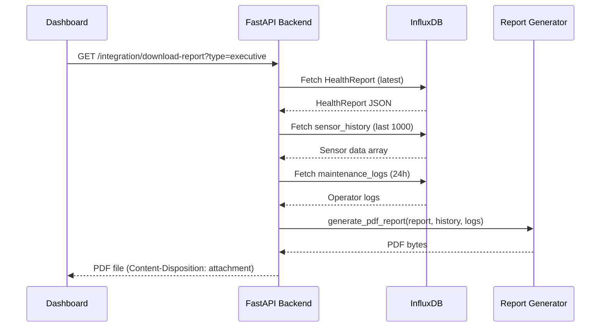

## Overview

The system generates three distinct report formats, each tailored for specific audiences and use cases:

| Report Type | Format | Target Audience | Key Features | File Size |
|-------------|--------|-----------------|--------------|----------|
| **Executive PDF** | 1-page PDF | Plant Managers | Health Grade (A-F), KPIs, Last 2 Logs | ~50 KB |
| **Analyst Excel** | Multi-sheet XLSX | Data Analysts | Summary + Operator Logs + Raw Sensor Data | ~200 KB |
| **Industrial Certificate** | 5-page PDF | Engineers | ML Explainability, ROI, Audit Trail | ~150 KB |

<Info>
  **The Snapshot Rule**: All reports use **persisted HealthReport data** from the moment of generation. Values are NOT re-computed. This ensures audit compliance and reproducibility.
</Info>

## Executive PDF Report

### Purpose

High-impact 1-page summary for **Plant Managers** and **Operations Directors** who need quick health status without technical details.

### Contents

<Accordion title="Page Layout">
  
  **Header**
  - Asset ID and Report Generation Date
  - Model Version and Report ID
  
  **Health Grade Box** (Large, Centered)
  - Letter Grade: A (Excellent) → F (Critical)
  - Grade Color: Green → Red
  - Health Score: 68/100
  - Description: "Good Condition"
  
  **Key Performance Indicators** (4 Columns)
  - Max Vibration (g)
  - Days to Maintenance
  - Critical Alerts Count
  - Risk Level (Color-coded)
  
  **Cumulative Prognostics** (if available)
  - Degradation Index: 32.0%
  - Damage Rate: 0.00162 /s
  - Remaining Useful Life: 47.3 hours
  
  **Maintenance Snapshot**
  - Last 2 Operator Logs (Event Time, Type, Severity, Note)
  
  **Footer**
  - Generation Timestamp (UTC)
  - Model Version
  - Report ID (first 8 chars)

</Accordion>

### Health Grade Mapping

```python
# From generator.py:60-75
def get_health_grade(score: int) -> tuple:
    if score >= 90:
        return ('A', colors.green, 'Excellent')
    elif score >= 75:
        return ('B', colors.light_green, 'Good')
    elif score >= 50:
        return ('C', colors.amber, 'Fair')
    elif score >= 25:
        return ('D', colors.orange, 'Poor')
    else:
        return ('F', colors.red, 'Critical')
```

| Health Score | Grade | Color | Description |
|--------------|-------|-------|-------------|
| 90-100 | A | Green | Excellent - Continue standard monitoring |
| 75-89 | B | Light Green | Good - No immediate action |
| 50-74 | C | Amber | Fair - Add to next maintenance cycle |
| 25-49 | D | Orange | Poor - Schedule maintenance soon |
| 0-24 | F | Red | Critical - Immediate attention required |

### API Endpoint

```http
GET /integration/download-report?type=executive
```

**Response Headers**:
```
Content-Type: application/pdf
Content-Disposition: attachment; filename="Report_Motor-01_20260302_1423.pdf"
```

### Example Output

```
┌─────────────────────────────────────────────────┐
│     EXECUTIVE HEALTH SUMMARY                    │
│  Asset Health Certificate • Report ID: a3f8b2c1 │
├─────────────────────────────────────────────────┤
│ Asset ID: Motor-01    Report Generated: 2026-03-02 14:23 UTC │
│ Data Capture: 2026-03-02 14:20:15 UTC  Model Version: detector:2.0|baseline:2024-01-15 │
├─────────────────────────────────────────────────┤
│                                                 │
│                      ╔════╗                     │
│                      ║  C ║                     │
│                      ╚════╝                     │
│                  Fair Condition                 │
│               Health Score: 68/100              │
│                                                 │
├────────────┬────────────┬────────────┬──────────┤
│ Max Vibration │ Days to Maint │ Critical Alerts │ Risk Level │
│   0.245 g     │     18.5      │       3         │  MODERATE  │
├───────────────────────────────────────────────────┤
│ Cumulative Prognostics:                           │
│ • DI: 32.0%  • Damage Rate: 0.00162/s  • RUL: 47.3h │
├───────────────────────────────────────────────────┤
│ Recent Maintenance Activity:                      │
│ 2026-03-02 12:15 | Corrective Maint | HIGH | Bearing replaced │
│ 2026-03-01 08:30 | Inspection | MEDIUM | Routine inspection completed │
└───────────────────────────────────────────────────┘
```

## Analyst Excel Report

### Purpose

**Multi-sheet workbook** for **Data Analysts** and **Reliability Engineers** who need granular data for trend analysis and correlation studies.

### Sheet 1: Summary

**Key Metrics** (Vertical Layout):

| Metric | Value |
|--------|-------|
| Report ID | a3f8b2c1-7d4e-4b9a-8f2c-1e5d6a7b9c0d |
| Asset ID | Motor-01 |
| Report Generated (UTC) | 2026-03-02 14:23:15 UTC |
| Health Score | 68/100 |
| Health Grade | C |
| Risk Level | MODERATE |
| Maintenance Window (Days) | 18.5 |
| Model Version | detector:2.0\|baseline:2024-01-15 |
| --- | --- |
| Degradation Index (DI) | 32.0% |
| Damage Rate (DI/s) | 0.00162 |
| Remaining Useful Life (Hours) | 47.3 |
| --- | --- |
| Total Data Points | 4,587 |
| Session Duration (Hours) | 1.27 |
| Max Vibration (g) | 0.2453 |
| Max Current (A) | 18.72 |
| Total Anomalies Detected | 23 |

### Sheet 2: Operator_Logs

**Ground-Truth Maintenance Events** (sorted by Event Time descending):

| Event Time | Type | Severity | Technician Note |
|------------|------|----------|----------------|
| 2026-03-02 12:15:00 | Corrective Maintenance | HIGH | Bearing replaced due to excessive vibration |
| 2026-03-01 08:30:00 | Scheduled Inspection | MEDIUM | Routine inspection completed — no anomalies observed |
| 2026-02-28 16:45:00 | Calibration | LOW | Sensor calibration verified within tolerance |
| ... | ... | ... | ... |

<Note>
  **Sanitized Notes**: Empty or placeholder notes (e.g., "aaa", "test") are replaced with professional defaults like "Routine inspection completed — no anomalies observed."
</Note>

### Sheet 3: Raw_Sensor_Data

**Complete Sensor Timeline** (up to 10,000 recent samples):

| Timestamp | Vibration (g) | Current (A) | Voltage (V) | Power Factor | Anomaly_Score | Status |
|-----------|---------------|-------------|-------------|--------------|---------------|--------|
| 2026-03-02 14:23:15 | 0.245 | 17.3 | 228.5 | 0.89 | 0.72 | ANOMALY |
| 2026-03-02 14:23:14 | 0.238 | 17.1 | 229.2 | 0.90 | 0.68 | ANOMALY |
| 2026-03-02 14:23:13 | 0.120 | 15.8 | 230.1 | 0.92 | 0.12 | NORMAL |
| ... | ... | ... | ... | ... | ... | ... |

**Status Derivation**:
```python
# From generator.py:617-618
is_anomaly = reading.get('is_faulty', False) or reading.get('is_anomaly', False)
status = 'ANOMALY' if is_anomaly else 'NORMAL'
```

### API Endpoint

```http
GET /integration/download-report?type=excel
```

**Response Headers**:
```
Content-Type: application/vnd.openxmlformats-officedocument.spreadsheetml.sheet
Content-Disposition: attachment; filename="Report_Motor-01_20260302_1423.xlsx"
```

### Column Widths (Auto-sized)

```python
# From generator.py:626-643
ws_summary.column_dimensions['A'].width = 30  # Metric names
ws_summary.column_dimensions['B'].width = 40  # Values

ws_logs.column_dimensions['A'].width = 20     # Event Time
ws_logs.column_dimensions['B'].width = 25     # Type
ws_logs.column_dimensions['C'].width = 12     # Severity
ws_logs.column_dimensions['D'].width = 50     # Technician Note

ws_raw.column_dimensions['A'].width = 20      # Timestamp
for col in ['B', 'C', 'D', 'E', 'F', 'G']:
    ws_raw.column_dimensions[col].width = 15  # Sensor columns
```

## Industrial Certificate (5-Page PDF)

### Purpose

**Comprehensive technical report** for **Reliability Engineers** and **Maintenance Teams** who need ML explainability, ROI analysis, and audit compliance.

### Page 1: Executive Summary

- **Title**: "Industrial Asset Diagnostic Report"
- **Asset Info Box**: ID, Type, Timestamps, Model Version
- **Health Gauge**: 0-100 semicircular dial with color-coded zones
- **Key Metrics Row**: RUL (days), Risk Level, Anomaly Score
- **Summary Paragraph**: Risk-level-specific narrative

### Page 2: Sensor Analysis

**Current Readings Table**:

| Sensor | Value | Unit | Baseline | % Deviation | Status |
|--------|-------|------|----------|-------------|--------|
| Voltage | 228.50 | V | 230.00 | -0.7% | NORMAL |
| Current | 17.30 | A | 15.00 | +15.3% | ELEVATED |
| Power Factor | 0.89 | - | 0.95 | -6.3% | ELEVATED |
| Vibration | 0.245 | g | 0.00 | N/A | CRITICAL |
| Power | 3.52 | kW | 3.28 | +7.3% | ELEVATED |

**24-Hour Statistics** (Simulated):

| Sensor | Min | Max | Mean | Std Dev |
|--------|-----|-----|------|----------|
| Voltage | 225.0 | 232.0 | 229.3 | 1.8 |
| Current | 14.2 | 18.7 | 16.1 | 1.2 |
| ... | ... | ... | ... | ... |

**Maintenance Correlation Analysis**:
- Sensor readings with nearby maintenance events
- Highlights high anomaly scores + maintenance logs
- Used for supervised ML training

### Page 3: ML Explainability

**Feature Contribution Chart** (Horizontal Bar Chart):
```
Vibration Variance (σ=0.17g)  ████████████████████████ 45.2%
Current Peak-to-Peak          ████████████████ 28.7%
Power Factor Efficiency       ██████████ 16.3%
Voltage Stability             ████ 9.8%
```

**Key Insights** (Bullet List):
- 🔴 **Vibration Variance** contributed **45.2%** to the risk assessment. Current value (0.17g) is 5.2σ from baseline. [CRITICAL]
- 🟡 **Current Peak-to-Peak** contributed **28.7%** to the risk assessment. Current value (8.5A) is 3.1σ from baseline. [ELEVATED]
- ...

**Primary Driver Analysis**:
> "The primary contributor to the current risk state is **Vibration**. This factor showed the highest deviation from expected baseline values and requires immediate attention as part of the maintenance response."

### Page 4: Business ROI & Maintenance

**ROI Analysis Table**:

| Metric | Value | Notes |
|--------|-------|-------|
| Est. Preventive Maintenance Cost | $2,000 | Planned service intervention |
| Cost of Unplanned Failure | $50,000 | Includes downtime + repairs |
| Potential Savings | $48,000 | Per prevented failure event |
| ROI Multiplier | **25x** | Return on maintenance investment |

**Recommended Maintenance Actions** (Dynamic, based on primary driver):

```python
# From industrial_report.py:1089-1099
MAINTENANCE_ACTIONS = {
    'vibration': [
        ('CRITICAL', 'Inspect bearings and mounting. Check for misalignment.', 'URGENT'),
        ('HIGH', 'Schedule vibration analysis. Order replacement bearings.', 'HIGH'),
        ('MODERATE', 'Increase monitoring frequency. Review lubrication schedule.', 'MEDIUM'),
    ],
    'voltage': [
        ('CRITICAL', 'Check grid connection and transformer. Isolate from critical loads.', 'URGENT'),
        # ...
    ],
    # ...
}
```

**Supporting Actions** (Risk-based bullet list):
- For CRITICAL: "Isolate asset from critical production lines if possible"
- For HIGH: "Schedule maintenance window within next 48-72 hours"
- ...

### Page 5: Audit Trail & Compliance

**Process Log** (Millisecond Precision):

| Step | Process | Timestamp (UTC) | Status |
|------|---------|-----------------|--------|
| 1 | Data Ingestion | 2026-03-02 14:20:15.000 UTC | ✓ Complete |
| 2 | Feature Extraction | 2026-03-02 14:20:15.127 UTC | ✓ Complete |
| 3 | Batch ML Inference | 2026-03-02 14:20:15.245 UTC | ✓ Complete |
| 4 | Health Assessment | 2026-03-02 14:20:15.318 UTC | ✓ Complete |
| 5 | Report Persistence | 2026-03-02 14:20:15.402 UTC | ✓ Complete |
| 6 | PDF Report Generation | 2026-03-02 14:23:15.789 UTC | ✓ Complete |

<Info>
  Timestamps use millisecond precision (e.g., `.127`, `.245`) to show processing latency for audit purposes.
</Info>

**Operator Maintenance Logs** (24-hour window):
- Same table as Executive PDF but extended (up to 50 events)
- Severity color-coding: CRITICAL (red), HIGH (orange), MEDIUM (amber), LOW (green)

**Compliance Verification** (Checkboxes):

- ✅ **ISO 55000** - Asset Management: Report adheres to data integrity and traceability requirements
- ✅ **ISO 13374** - Condition Monitoring: ML-based anomaly detection follows diagnostic framework
- ✅ **IEC 60812** - FMEA: Health scoring includes failure mode analysis

### API Endpoint

```http
GET /integration/download-report?type=industrial
```

**Response Headers**:
```
Content-Type: application/pdf
Content-Disposition: attachment; filename="Report_Motor-01_20260302_1423.pdf"
```

## Report Generation Workflow



## Smart Filename Convention

All reports follow the pattern:
```
Report_{AssetID}_{YYYYMMDD_HHMM}.{ext}
```

**Examples**:
- `Report_Motor-01_20260302_1423.pdf` (Executive)
- `Report_Motor-01_20260302_1423.xlsx` (Analyst)
- `Report_Motor-01_20260302_1423.pdf` (Industrial - same as executive filename)

```python
# From generator.py:131-137
def generate_filename(asset_id: str, timestamp: datetime, extension: str) -> str:
    ts_str = timestamp.strftime('%Y%m%d_%H%M')
    safe_asset_id = asset_id.replace(' ', '_').replace('/', '-')
    return f"Report_{safe_asset_id}_{ts_str}.{extension}"
```

## The Snapshot Rule

<Warning>
  **CRITICAL RULE**: Reports use **persisted HealthReport data**, NOT re-computed values.
  
  **Why?**
  1. **Audit Compliance**: The report reflects what the system "thought" at capture time
  2. **Reproducibility**: Re-running the report produces identical results
  3. **Performance**: No need to re-run ML inference
  
  **Example**:  
  If a HealthReport was generated at 14:20:15 with health=68, the PDF generated at 14:23:15 will show health=68, even if live health is now 72.
</Warning>

### Implementation

```python
# From generator.py:140-165
def generate_pdf_report(
    report: HealthReport,  # <-- Pre-computed, persisted data
    sensor_history: Optional[List[Dict[str, Any]]] = None,
    degradation_index: Optional[float] = None,
    # ...
) -> bytes:
    # Use report.health_score directly (NO re-computation)
    grade, color, desc = get_health_grade(report.health_score)
    
    # Use report.risk_level directly
    risk_color = _get_risk_color(report.risk_level.value)
    
    # Calculate anomaly score from health (inverse relationship)
    # This is for display only, not used for inference
    anomaly_score = max(0, min(100, 100 - report.health_score))
```

## Report Customization

### Color Schemes

```python
# From reports/constants.py
RISK_COLORS = {
    RiskLevel.LOW: colors.HexColor('#10b981'),      # Green
    RiskLevel.MODERATE: colors.HexColor('#f59e0b'), # Amber
    RiskLevel.HIGH: colors.HexColor('#f97316'),     # Orange
    RiskLevel.CRITICAL: colors.HexColor('#ef4444'), # Red
}

SEVERITY_COLORS = {
    'CRITICAL': colors.HexColor('#ef4444'),  # Red
    'HIGH': colors.HexColor('#f97316'),      # Orange
    'MEDIUM': colors.HexColor('#f59e0b'),    # Amber
    'LOW': colors.HexColor('#10b981'),       # Green
}
```

### ROI Constants

```python
# From reports/constants.py (hardcoded per spec)
COST_MAINTENANCE_USD = 2000   # Preventive maintenance
COST_FAILURE_USD = 50000      # Unplanned failure (downtime + repairs)

roi_multiplier = COST_FAILURE_USD / COST_MAINTENANCE_USD  # 25x
savings = COST_FAILURE_USD - COST_MAINTENANCE_USD  # $48,000
```

## When to Use Each Report

<CardGroup cols={3}>
  <Card title="Executive PDF" icon="file-pdf">
    **Use When**:  
    - Presenting to non-technical stakeholders
    - Weekly/monthly status reports
    - Immediate health snapshot needed
    
    **Advantages**:  
    - 1-page = quick review
    - Health grade (A-F) is intuitive
    - Fits on a single screen
  </Card>
  
  <Card title="Analyst Excel" icon="file-excel">
    **Use When**:  
    - Trend analysis over time
    - Correlating sensor data with maintenance
    - Training supervised ML models
    
    **Advantages**:  
    - Raw data for custom analysis
    - Operator logs for ground truth
    - Filterable/sortable in Excel
  </Card>
  
  <Card title="Industrial Certificate" icon="file-contract">
    **Use When**:  
    - Root cause analysis
    - Regulatory compliance audits
    - Engineering design reviews
    
    **Advantages**:  
    - ML explainability for trust
    - ROI justification for budget approval
    - Audit trail with millisecond timestamps
  </Card>
</CardGroup>

## Source Code Reference

Key implementation files:

- **Executive PDF**: `backend/reports/generator.py:140-454` - 1-page summary generator
- **Analyst Excel**: `backend/reports/generator.py:457-646` - Multi-sheet workbook
- **Industrial Certificate**: `backend/reports/industrial_report.py` - 5-page technical report (1374+ lines)
- **Report API**: `backend/api/integration_routes.py` - `/integration/download-report` endpoint
- **Constants**: `backend/reports/constants.py` - Colors, costs, thresholds
- **Mock Data**: `backend/reports/mock_data.py` - Simulated 24h stats and trends

## Next Steps

<CardGroup cols={2}>
  <Card title="Sensor Ingestion" icon="sensor" href="/features/sensor-ingestion">
    Learn how data flows into the system for report generation
  </Card>
  <Card title="Health Assessment" icon="heart-pulse" href="/features/health-assessment">
    Understand the metrics that power these reports
  </Card>
</CardGroup>
