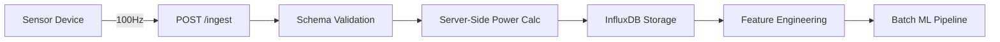

## Overview

The Predictive Maintenance System ingests high-frequency sensor data at 100Hz (100 samples per second) from industrial assets like motors, pumps, and compressors. The ingestion pipeline validates, transforms, and persists sensor events with server-side power computation.

## Ingestion Architecture



## Sensor Data Model

The system captures four primary signals:

| Signal | Unit | Description | Validation |
|--------|------|-------------|------------|
| `voltage_v` | Volts | Line voltage | ≥ 0 |
| `current_a` | Amperes | Load current | ≥ 0 |
| `power_factor` | Dimensionless | Efficiency ratio | 0.0 - 1.0 |
| `vibration_g` | g-force | Mechanical vibration | ≥ 0 |

<Note>
  **Power Calculation:** The `power_kw` field is **computed server-side** and must NOT be provided by clients. Requests including `power_kw` will be rejected with a 422 validation error.
</Note>

## Ingestion Endpoint

### Request Format

```http
POST /ingest
Content-Type: application/json

{
  "event_id": "550e8400-e29b-41d4-a716-446655440000",
  "timestamp": "2026-03-02T12:00:00Z",
  "asset": {
    "asset_id": "Motor-01",
    "asset_type": "induction_motor"
  },
  "signals": {
    "voltage_v": 230.5,
    "current_a": 15.2,
    "power_factor": 0.92,
    "vibration_g": 0.15
  },
  "context": {
    "operating_state": "RUNNING",
    "source": "modbus_gateway"
  }
}
```

### Field Requirements

<Accordion title="event_id Validation">
  - **Must be UUIDv4**: The system validates that the UUID is version 4 specifically
  - **Uniqueness**: Used for deduplication and event tracking
  - **Example**: `550e8400-e29b-41d4-a716-446655440000`
  
  Invalid UUIDs (e.g., v1, v3, v5) will be rejected with error:
  ```json
  {
    "detail": "event_id must be UUID version 4, got version 1"
  }
  ```
</Accordion>

<Accordion title="timestamp Validation">
  - **Must be timezone-aware**: Naive timestamps are rejected
  - **UTC conversion**: Non-UTC timestamps are automatically converted to UTC
  - **ISO 8601 format**: `2026-03-02T12:00:00Z` or `2026-03-02T12:00:00+00:00`
  
  Error for naive timestamps:
  ```json
  {
    "detail": "timestamp must be timezone-aware. Provide UTC timestamp like '2026-01-11T12:00:00Z'"
  }
  ```
</Accordion>

<Accordion title="operating_state Enumeration">
  Allowed values (case-insensitive, normalized to uppercase):
  - `RUNNING` - Asset is actively operating
  - `IDLE` - Asset is powered but not under load
  - `OFF` - Asset is powered down
  
  Any other value will trigger validation error:
  ```json
  {
    "detail": "operating_state must be one of {RUNNING, IDLE, OFF}, got 'STARTING'"
  }
  ```
</Accordion>

## Server-Side Power Computation

Power is calculated using the three-phase power formula:

```python
power_kw = (voltage_v × current_a × power_factor) / 1000
```

<Warning>
  **CRITICAL RULE**: Clients must **NOT** provide `power_kw` in the request. The server computes this value from the three input signals to ensure consistency and prevent data manipulation.
  
  Requests with `power_kw` set will fail validation:
  ```json
  {
    "detail": [
      {
        "loc": ["body", "signals", "power_kw"],
        "msg": "power_kw must not be provided by client. Server computes this value from voltage_v × current_a × power_factor / 1000",
        "type": "value_error"
      }
    ]
  }
  ```
</Warning>

### Example Calculation

For a healthy motor:
- Voltage: 230.0 V
- Current: 15.0 A
- Power Factor: 0.95

```
power_kw = (230.0 × 15.0 × 0.95) / 1000 = 3.2775 kW
```

## Response Format

### Success Response (200 OK)

```json
{
  "status": "accepted",
  "event_id": "550e8400-e29b-41d4-a716-446655440000",
  "timestamp": "2026-03-02T12:00:00Z",
  "asset": {
    "asset_id": "Motor-01",
    "asset_type": "induction_motor"
  },
  "signals": {
    "voltage_v": 230.5,
    "current_a": 15.2,
    "power_factor": 0.92,
    "power_kw": 3.22,
    "vibration_g": 0.15
  },
  "context": {
    "operating_state": "RUNNING",
    "source": "modbus_gateway"
  },
  "message": "Event ingested successfully"
}
```

<Note>
  Notice that `power_kw` is now included in the response even though it wasn't in the request.
</Note>

### Error Responses

| Status Code | Scenario | Response |
|-------------|----------|----------|
| 422 | Validation error | Invalid field values or constraints |
| 503 | Database unavailable | InfluxDB connection failure |

#### 422 Validation Error Example

```json
{
  "detail": [
    {
      "loc": ["body", "signals", "power_factor"],
      "msg": "ensure this value is less than or equal to 1.0",
      "type": "value_error.number.not_le"
    }
  ]
}
```

#### 503 Service Unavailable Example

```json
{
  "detail": "InfluxDB is not available in this deployment. Use /system/* endpoints for demo."
}
```

## 100Hz Ingestion Capability

The system is designed to handle **100 samples per second** from each asset:

- **Throughput**: 100 events/second/asset
- **Batch Processing**: Events are aggregated into 1-second windows for ML inference
- **Real-time Updates**: Dashboard updates with ~1 second latency

### Performance Characteristics

```python
# Generator configuration (source/generator/config.py)
SAMPLE_RATE_HZ = 100  # 100 samples per second
BATCH_SIZE = 100      # 1-second windows
```

<Info>
  The system reduces 100 raw samples into a **16-dimensional feature vector** per second using statistical aggregation (mean, std, peak-to-peak, RMS). This enables anomaly detection on high-frequency patterns like jitter and spikes.
</Info>

## Data Persistence

Ingested events are written to **InfluxDB Cloud** as time-series data:

### Measurement Schema

```flux
// Measurement: sensor_events
// Tags:
//   - asset_id
//   - asset_type
//   - operating_state
//   - source
// Fields:
//   - voltage_v (float)
//   - current_a (float)
//   - power_factor (float)
//   - power_kw (float)         // Server-computed
//   - vibration_g (float)
// Timestamp: event timestamp (UTC)
```

### Graceful Degradation

If InfluxDB is unavailable:
1. System falls back to **mock mode**
2. Data is logged to console for debugging
3. `/health` endpoint reports `"database": "mock"`
4. Demo features remain available via `/system/*` endpoints

```json
// /health response in mock mode
{
  "status": "healthy",
  "database": "mock",
  "message": "Running in mock mode. Data persisted to console. Set INFLUX_TOKEN for full persistence."
}
```

## Validation Rules Summary

<Accordion title="Complete Validation Checklist">
  
  **Event Metadata**
  - ✅ `event_id`: Valid UUIDv4
  - ✅ `timestamp`: Timezone-aware UTC
  
  **Asset**
  - ✅ `asset_id`: Non-empty string
  - ✅ `asset_type`: Non-empty string
  
  **Signals**
  - ✅ `voltage_v`: ≥ 0
  - ✅ `current_a`: ≥ 0
  - ✅ `power_factor`: 0.0 ≤ value ≤ 1.0
  - ✅ `vibration_g`: ≥ 0
  - ❌ `power_kw`: **Must be absent** (server-computed)
  
  **Context**
  - ✅ `operating_state`: Must be RUNNING, IDLE, or OFF (case-insensitive)
  - ✅ `source`: String (default: "api")

</Accordion>

## Source Code Reference

Key implementation files:

- **API Route**: `backend/api/routes.py:61-126` - `/ingest` endpoint handler
- **Schema Validation**: `backend/api/schemas.py:69-114` - Pydantic models with validators
- **Power Computation**: `backend/api/services.py` - Business logic for server-side calculations

## Next Steps

<CardGroup cols={2}>
  <Card title="Anomaly Detection" icon="radar" href="/features/anomaly-detection">
    Learn how ingested data is analyzed using dual Isolation Forest models
  </Card>
  <Card title="Health Assessment" icon="heart-pulse" href="/features/health-assessment">
    Understand how sensor data drives health scoring and risk classification
  </Card>
</CardGroup>
