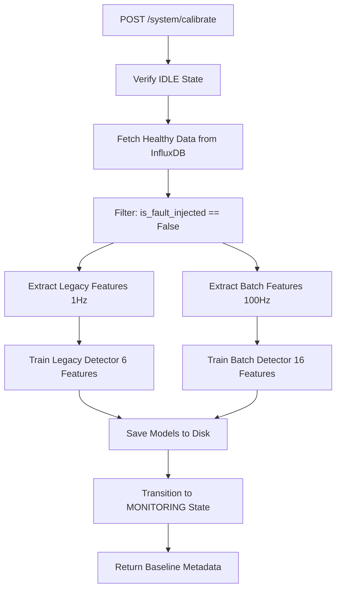
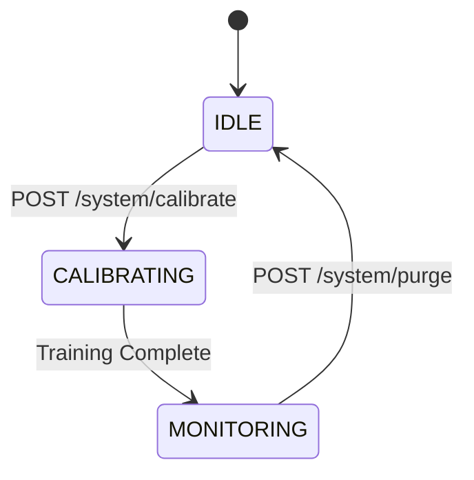

# Baseline Training

Calibration is the process of training the Isolation Forest models on **healthy data only** to establish a baseline for "normal" asset behavior. This happens once during system commissioning via the `/system/calibrate` endpoint.

## Calibration Workflow



### Endpoint Contract

```http
POST /system/calibrate
Content-Type: application/json

{
  "asset_id": "Motor-01",
  "lookback_minutes": 60,
  "min_samples": 100
}
```

**Response:**
```json
{
  "status": "calibrated",
  "asset_id": "Motor-01",
  "training_window": {
    "start": "2026-03-02T00:00:00Z",
    "end": "2026-03-02T01:00:00Z",
    "sample_count": 3600
  },
  "legacy_model": {
    "features": 6,
    "samples": 3600,
    "threshold": 0.4231
  },
  "batch_model": {
    "features": 16,
    "samples": 3540,  // Some windows may be incomplete
    "threshold": 0.3892
  }
}
```

---

## Healthy Baseline Data

### Definition: "Healthy Data Only"

From `baseline.py:188-196`:

```python
def _filter_healthy_data(self, data):
    """
    Filter to healthy data only (is_fault_injected == False).
    
    If is_fault_injected column doesn't exist, assumes all data is healthy.
    """
    if 'is_fault_injected' in data.columns:
        return data[data['is_fault_injected'] == False].copy()
    return data.copy()
```

**Criteria:**
- `is_fault_injected == False` (fault injection flag OFF)
- No operator-logged maintenance events during window
- Sensor values within expected ranges (validated by baseline builder)

<Warning>
**Never train on faulty data!**

If the training window includes faults, the model will learn to accept failure modes as "normal," rendering anomaly detection useless.
</Warning>

### Minimum Data Requirements

```python
# From baseline.py:26
MIN_COVERAGE_RATIO = 0.80  # 80% of samples must be valid (non-NaN)

# From detector.py:209
if base_features.shape[0] < 10:
    raise ValueError(f"Insufficient data for training: {base_features.shape[0]} samples (need >= 10)")

# From batch_detector.py:128
if len(feature_rows) < 10:
    raise ValueError(f"Need >= 10 training windows, got {len(feature_rows)}")
```

**Minimum thresholds:**
- **10 samples minimum** (hard floor)
- **80% coverage** (max 20% NaN allowed)
- **60 minutes recommended** (ensures 1-hour rolling windows are fully populated)

<Accordion title="Why 80% coverage?">
From `baseline.py:232-235`:

```python
coverage = valid_count / total_count
if coverage < self.min_coverage:
    raise BaselineBuildError(
        f"Insufficient coverage for '{column}': {coverage:.1%} < {self.min_coverage:.0%} required"
    )
```

If more than 20% of data is NaN (missing sensors, cold-start windows, etc.), the statistical profile becomes unreliable. The system **fails fast** rather than training on bad data.
</Accordion>

---

## Baseline Statistical Profiles

### SignalProfile Schema

```python
# From baseline.py:29-35
class SignalProfile(BaseModel):
    """Statistical profile for a single signal or feature."""
    mean: float = Field(..., description="Mean value from healthy data")
    std: float = Field(..., ge=0, description="Standard deviation")
    min: float = Field(..., description="Minimum observed value (descriptive)")
    max: float = Field(..., description="Maximum observed value (descriptive)")
    sample_count: int = Field(..., ge=0, description="Number of valid samples used")
```

**Example Profile (voltage):**
```json
{
  "mean": 230.2,
  "std": 2.1,
  "min": 225.3,
  "max": 235.8,
  "sample_count": 3600
}
```

### Profile Calculation

```python
# From baseline.py:210-246
def _compute_profile(self, data, column: str) -> Optional[SignalProfile]:
    series = data[column]
    total_count = len(series)
    valid_count = series.notna().sum()
    
    # Check coverage
    coverage = valid_count / total_count
    if coverage < self.min_coverage:
        raise BaselineBuildError(
            f"Insufficient coverage for '{column}': {coverage:.1%} < {self.min_coverage:.0%} required"
        )
    
    # Compute statistics (ignoring NaN)
    valid_data = series.dropna()
    
    return SignalProfile(
        mean=round(float(valid_data.mean()), 6),
        std=round(float(valid_data.std()), 6),
        min=round(float(valid_data.min()), 6),
        max=round(float(valid_data.max()), 6),
        sample_count=int(valid_count)
    )
```

**Key points:**
- NaN values are **ignored** (not treated as zero)
- All statistics computed on `valid_data.dropna()`
- `min`/`max` are **descriptive** (observed range), not prescriptive thresholds

---

## Training the Legacy Model (6 Features)

```python
# From detector.py:188-249 (simplified)
def train(self, data) -> None:
    # 1. Extract base features
    base_features = self._extract_base_features(data)
    
    # 2. Add derived features
    enhanced_features = self._compute_derived_features(base_features)
    
    # 3. Drop rows with NaN (incomplete feature windows)
    features_clean = enhanced_features.dropna()
    
    if features_clean.shape[0] < 10:
        raise ValueError(f"Insufficient valid data after dropping NaN")
    
    # 4. Get all feature columns (6 total)
    all_feature_cols = [col for col in FEATURE_COLUMNS if col in features_clean.columns]
    feature_matrix = features_clean[all_feature_cols]
    
    # 5. Scale ALL features (StandardScaler)
    self._scaler = StandardScaler()
    features_scaled = self._scaler.fit_transform(feature_matrix)
    
    # 6. Train Isolation Forest
    self._model = IsolationForest(
        contamination=self.contamination,  # 0.05
        n_estimators=self.n_estimators,    # 100
        random_state=self.random_state,    # 42
        n_jobs=-1  # Use all cores
    )
    self._model.fit(features_scaled)
    
    # 7. Compute quantile threshold for calibration
    training_decisions = self._model.decision_function(features_scaled)
    self._threshold_score = float(np.percentile(-training_decisions, 99))
    
    self._is_trained = True
    self._training_timestamp = datetime.now(timezone.utc)
    self._training_sample_count = features_clean.shape[0]
```

### Isolation Forest Hyperparameters

| Parameter | Value | Purpose |
|-----------|-------|--------|
| `contamination` | 0.05 | Expect 5% outliers even in healthy data (natural variance) |
| `n_estimators` | 100 | Number of decision trees (balances accuracy vs speed) |
| `random_state` | 42 | Ensures deterministic training |
| `n_jobs` | -1 | Use all CPU cores for parallel training |

### Quantile Calibration (99th Percentile)

```python
# From detector.py:239-245
training_decisions = self._model.decision_function(features_scaled)
# Decision function: higher = more normal
# We want the 99th percentile of healthy data as our threshold
# Invert the sign because we'll invert later for anomaly scores
self._threshold_score = float(np.percentile(-training_decisions, 99))
```

**Why 99th percentile?**
- Even healthy data has outliers (1% are "unusual but not faulty")
- This threshold marks the boundary: scores above it are true anomalies
- Used in calibrated scoring formula (see `_calibrated_score` in detector.py:362-397)

<Accordion title="Calibrated Scoring Formula">
```python
# From detector.py:362-397
def _calibrated_score(self, decision_value: float) -> float:
    # Invert decision value (higher decision = more normal, so negate)
    raw_score = -decision_value
    
    # Calibrate against training threshold
    # threshold_score is the 99th percentile of healthy (-decision) values
    calibration_factor = self._threshold_score * 1.5
    
    if calibration_factor > 0:
        calibrated = raw_score / calibration_factor
    else:
        # Fallback if threshold is 0 (shouldn't happen)
        calibrated = raw_score + 0.5
    
    # Clip to [0, 1]
    return float(np.clip(calibrated, 0.0, 1.0))
```

**Result:**
- Healthy data (< threshold) maps to scores < 0.67
- Anomalies (> threshold) map to scores > 0.67
- Maximum score is 1.0 (extreme anomaly)
</Accordion>

---

## Training the Batch Model (16 Features)

```python
# From batch_detector.py:113-179 (simplified)
def train(self, feature_rows: List[Dict[str, float]]) -> None:
    # 1. Build DataFrame from batch feature dicts
    df = pd.DataFrame(feature_rows)
    
    # 2. Validate columns
    missing = [c for c in BATCH_FEATURE_NAMES if c not in df.columns]
    if missing:
        raise ValueError(f"Missing batch feature columns: {missing}")
    
    feature_matrix = df[BATCH_FEATURE_NAMES].dropna()
    
    if len(feature_matrix) < 10:
        raise ValueError(f"After dropping NaN, only {len(feature_matrix)} rows remain")
    
    # 3. Store healthy stats for explainability
    self._healthy_means = {
        col: float(feature_matrix[col].mean()) for col in BATCH_FEATURE_NAMES
    }
    self._healthy_stds = {
        col: float(feature_matrix[col].std()) for col in BATCH_FEATURE_NAMES
    }
    
    # 4. Fit scaler
    self._scaler = StandardScaler()
    scaled = self._scaler.fit_transform(feature_matrix)
    
    # 5. Fit Isolation Forest (150 trees for 16-D space)
    self._model = IsolationForest(
        contamination=self.contamination,  # 0.05
        n_estimators=self.n_estimators,    # 150
        random_state=self.random_state,    # 42
        n_jobs=-1,
    )
    self._model.fit(scaled)
    
    # 6. Quantile calibration (99th percentile)
    decisions = self._model.decision_function(scaled)
    self._threshold_score = float(np.percentile(-decisions, 99))
    
    self._is_trained = True
    self._training_timestamp = datetime.now(timezone.utc)
    self._training_sample_count = len(feature_matrix)
```

### Healthy Statistics Storage

Unique to the batch model:

```python
# From batch_detector.py:148-153
self._healthy_means = {
    col: float(feature_matrix[col].mean()) for col in BATCH_FEATURE_NAMES
}
self._healthy_stds = {
    col: float(feature_matrix[col].std()) for col in BATCH_FEATURE_NAMES
}
```

These are used later for **z-score explainability**:

```python
# From batch_detector.py:257
zscore = (val - h_mean) / h_std
```

Example output:
```
"vibration_g_std: 0.17 vs healthy 0.02 (30.0σ above normal)"
```

---

## Model Persistence

After training, models are saved to disk:

```python
# Legacy model
detector.save_model("backend/models")  
# → backend/models/detector_{asset_id}.joblib

# Batch model
batch_detector.save("backend/models")
# → backend/models/batch_detector_{asset_id}.joblib
```

### Saved Artifacts (Legacy)

```python
# From detector.py:418-429
model_data = {
    'asset_id': self.asset_id,
    'model': self._model,           # Trained IsolationForest
    'scaler': self._scaler,         # Fitted StandardScaler
    'contamination': self.contamination,
    'n_estimators': self.n_estimators,
    'random_state': self.random_state,
    'training_timestamp': self._training_timestamp,
    'training_sample_count': self._training_sample_count,
    'threshold_score': self._threshold_score,  # 99th percentile
    'version': 2,  # Model version
}
```

### Saved Artifacts (Batch)

```python
# From batch_detector.py:355-368
data = {
    "asset_id": self.asset_id,
    "model": self._model,
    "scaler": self._scaler,
    "contamination": self.contamination,
    "n_estimators": self.n_estimators,
    "random_state": self.random_state,
    "training_timestamp": self._training_timestamp,
    "training_sample_count": self._training_sample_count,
    "threshold_score": self._threshold_score,
    "healthy_means": self._healthy_means,      # For explainability
    "healthy_stds": self._healthy_stds,        # For z-scores
    "version": 3,  # v3 = batch features
}
```

---

## State Transitions



**IDLE → CALIBRATING:**
- Triggered by `POST /system/calibrate`
- System fetches healthy data from InfluxDB
- Both models trained in parallel

**CALIBRATING → MONITORING:**
- Models saved to disk
- System begins real-time anomaly scoring
- Health assessment active

**MONITORING → IDLE:**
- Triggered by `POST /system/purge`
- Deletes all models, baselines, and InfluxDB data
- Resets DI to 0.0

<Warning>
Purging is **irreversible**. The system must be recalibrated before resuming monitoring.
</Warning>

---

## Recalibration Strategy

The system does **not auto-retrain** (by design). Manual recalibration is required when:

1. **Asset Replacement:** New motor installed → new baseline needed
2. **Major Maintenance:** Bearings replaced, alignment corrected → healthy baseline shifted
3. **Model Drift Detected:** Health scores no longer match ground truth

### Recalibration Workflow

```bash
# 1. Purge old baseline
curl -X POST https://api.example.com/system/purge

# 2. Collect new healthy data (run asset for 60+ minutes)
# ...

# 3. Train new baseline
curl -X POST https://api.example.com/system/calibrate \
  -H "Content-Type: application/json" \
  -d '{
    "asset_id": "Motor-01",
    "lookback_minutes": 60,
    "min_samples": 100
  }'
```

<Info>
Deliberate lack of auto-retraining prevents "drift acceptance" where the model slowly adapts to accept degradation as normal.
</Info>

---

## Baseline Validation

Before finalizing calibration, the system validates baseline quality:

```python
# From baseline.py:171-179
total_samples = len(data)
valid_samples = sum(
    data[col].notna().sum() for col in signal_profiles.keys()
) / len(signal_profiles)
valid_ratio = valid_samples / total_samples if total_samples > 0 else 0

training_meta = TrainingWindow(
    start=window_start,
    end=window_end,
    sample_count=total_samples,
    valid_sample_ratio=round(valid_ratio, 4)  # Logged for audit
)
```

**Validation checks:**
- ✅ At least 10 samples
- ✅ Coverage ≥ 80%
- ✅ All required signal columns present
- ✅ `is_fault_injected == False` for all rows

If any check fails, calibration aborts with a clear error message.

<Card title="Next Steps" icon="arrow-right">
- [Degradation Index](/ml/degradation-index) — Converting scores to health metrics
- [Feature Engineering](/ml/feature-engineering) — What gets fed into the models
</Card>
