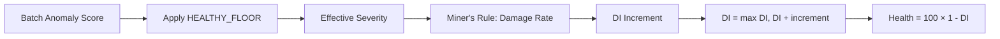

# Degradation Index (DI)

The **Degradation Index (DI)** is a cumulative damage accumulator that converts anomaly scores into a monotonically increasing health metric. Unlike instantaneous scores, DI captures **accumulated wear** over time.

## Core Concept

**Health is not just current state — it's cumulative history.**

A motor that experiences 5 minutes of severe vibration has sustained **permanent damage** that persists even after vibration returns to normal. DI tracks this irreversible degradation.



---

## Formula: Miner's Rule Damage Accumulation

From `assessor.py:355-395`:

```python
def compute_cumulative_degradation(
    last_di: float,
    batch_anomaly_score: float,
    dt: float = 1.0
) -> tuple:
    """
    Miner's Rule damage accumulation with dead-zone.
    
    Dead-zone:  scores < HEALTHY_FLOOR (0.65) → effective_severity = 0 → zero damage.
    Above floor: effective_severity = (score - HEALTHY_FLOOR) / (1 - HEALTHY_FLOOR)
    DI_inc = (effective_severity ^ 2) * SENSITIVITY_CONSTANT * dt
    new_di = max(last_di, last_di + DI_inc)   ← absolute monotonicity
    
    Args:
        last_di:              Previous Degradation Index [0, 1]
        batch_anomaly_score:  Current batch anomaly score [0, 1] (severity)
        dt:                   Time step in seconds (default 1.0)
    
    Returns:
        (new_di, damage_rate)
        new_di:      Updated DI, clamped to [0, 1], never < last_di
        damage_rate: Instantaneous damage rate (DI per second)
    """
    clamped = max(0.0, min(1.0, batch_anomaly_score))
    
    # Dead-zone: scores below HEALTHY_FLOOR produce zero damage
    if clamped < HEALTHY_FLOOR:
        effective_severity = 0.0
    else:
        # Remap [HEALTHY_FLOOR, 1.0] → [0.0, 1.0]
        effective_severity = (clamped - HEALTHY_FLOOR) / (1.0 - HEALTHY_FLOOR)
    
    damage_rate = (effective_severity ** 2) * SENSITIVITY_CONSTANT
    
    raw_di = last_di + damage_rate * dt
    # Monotonicity: DI must NEVER decrease
    new_di = max(last_di, raw_di)
    # Clamp to [0, 1]
    new_di = min(1.0, new_di)
    
    return (new_di, damage_rate)
```

### Mathematical Formulation

**Step 1: Apply Dead-Zone**

$$
\text{effective\_severity} = 
\begin{cases}
0 & \text{if } s < 0.65 \\
\frac{s - 0.65}{1.0 - 0.65} & \text{if } s \geq 0.65
\end{cases}
$$

where $s$ is the batch anomaly score.

**Step 2: Compute Damage Rate (Miner's Rule)**

$$
\text{damage\_rate} = (\text{effective\_severity})^2 \times 0.005
$$

**Step 3: Accumulate Damage**

$$
DI_{\text{new}} = \max(DI_{\text{last}}, \min(1.0, DI_{\text{last}} + \text{damage\_rate} \times \Delta t))
$$

The outer `max()` enforces **absolute monotonicity** — DI never decreases.

---

## Constants

### SENSITIVITY_CONSTANT = 0.005

From `assessor.py:54-58`:

```python
# Sensitivity constant for Miner's Rule damage accumulation
# DI_inc = (effective_severity ** 2) * SENSITIVITY_CONSTANT
# At score=1.0 (max fault), DI increases by 0.005 per second
# → Full degradation (DI=1.0) takes ~200 seconds of sustained max fault
# → Real faults (score ~0.85-0.95) drive 100→0% in ~4-5 minutes (demo-tuned)
SENSITIVITY_CONSTANT = 0.005
```

**Why 0.005?**
- At maximum anomaly (score = 1.0), effective severity = 1.0
- Damage rate = $1.0^2 \times 0.005 = 0.005$ per second
- Full degradation: $DI = 0 \to 1$ in $\frac{1.0}{0.005} = 200$ seconds

<Info>
This is **demo-tuned** for rapid visualization. In production, this would be calibrated based on asset Mean Time To Failure (MTTF) data.
</Info>

### HEALTHY_FLOOR = 0.65

From `assessor.py:60-66`:

```python
# Dead-zone floor: batch_scores below this are treated as healthy noise (zero damage).
# IsolationForest calibration produces non-zero scores (0.1–0.5) even on healthy data
# due to the contamination parameter.  Without this floor the DI accumulator
# "self-harms" — phantom damage accrues during normal operation.
# Scores above HEALTHY_FLOOR are remapped to [0, 1] via:
#   effective_severity = (score - HEALTHY_FLOOR) / (1 - HEALTHY_FLOOR)
HEALTHY_FLOOR = 0.65
```

**Problem it solves:**

Isolation Forest with `contamination=0.05` assigns scores of 0.1–0.5 even to perfectly healthy data (top 5% of healthy distribution are marked as "outliers"). 

Without the dead-zone, these false-positive scores would accumulate phantom damage:

```python
# WITHOUT dead-zone (broken):
score = 0.5  # Healthy data, but above 0
damage_rate = 0.5**2 * 0.005 = 0.00125 per second
DI += 0.00125 every second  # Motor degrades while healthy!
```

With the dead-zone:

```python
# WITH dead-zone (correct):
score = 0.5  # Below HEALTHY_FLOOR
effective_severity = 0.0  # Treated as healthy noise
damage_rate = 0.0  # Zero damage
DI unchanged  # No phantom degradation
```

<Warning>
**Dead-zone is critical for preventing false degradation.**

Without it, the system would report 100% → 0% health over ~24 hours even with no faults.
</Warning>

### DI Threshold Milestones

From `assessor.py:69-72`:

```python
# DI threshold milestones for Log Watcher warnings
DI_THRESHOLD_15 = 0.15    # "Motor fatigue reached 15%"
DI_THRESHOLD_30 = 0.30    # "Motor fatigue reached 30%"
DI_THRESHOLD_50 = 0.50    # "Motor fatigue reached 50%"
DI_THRESHOLD_75 = 0.75    # "Motor fatigue reached 75% — CRITICAL"
```

Used to emit progressive warnings as damage accumulates.

---

## Monotonicity Guarantee

**DI must NEVER decrease** (except on explicit purge).

From `assessor.py:389-393`:

```python
raw_di = last_di + damage_rate * dt
# Monotonicity: DI must NEVER decrease
new_di = max(last_di, raw_di)
# Clamp to [0, 1]
new_di = min(1.0, new_di)
```

**Why?**

Damage is **irreversible**. A quiet minute after a fault doesn't erase the accumulated wear. The motor's bearings don't magically repair themselves.

### Example Timeline

| Time | Batch Score | Effective Severity | Damage Rate | DI | Health |
|------|-------------|-------------------|-------------|-----|--------|
| 0s | 0.50 | 0.0 (< floor) | 0.000 | 0.000 | 100% |
| 60s | 0.50 | 0.0 | 0.000 | 0.000 | 100% |
| 120s | **0.95** | **0.857** | **0.0037** | 0.222 | **78%** |
| 180s | **0.95** | **0.857** | **0.0037** | 0.444 | **56%** |
| 240s | 0.50 | 0.0 | 0.000 | **0.444** ← stays | **56%** ← stays |
| 300s | 0.50 | 0.0 | 0.000 | **0.444** | **56%** |

Notice at 240s: score drops to 0.50 (healthy), but DI **does not decrease**. Health remains at 56% because the damage is permanent.

---

## Deriving Health from DI

From `assessor.py:398-411`:

```python
def health_from_degradation(di: float) -> int:
    """
    Derive health score directly from Degradation Index.
    
    health = (1.0 - DI) * 100, clamped to [0, 100]
    
    Args:
        di: Degradation Index [0, 1]
    
    Returns:
        Health score integer [0, 100]
    """
    raw = (1.0 - di) * 100.0
    return int(max(0, min(100, round(raw))))
```

**Formula:**
$$
\text{Health} = \text{round}(100 \times (1.0 - DI))
$$

**Mapping:**

| DI | Health | Risk Level |
|----|--------|------------|
| 0.00 | 100% | LOW |
| 0.15 | 85% | LOW |
| 0.25 | 75% | MODERATE |
| 0.50 | 50% | HIGH |
| 0.75 | 25% | CRITICAL |
| 1.00 | 0% | CRITICAL |

---

## Remaining Useful Life (RUL)

From `assessor.py:414-431`:

```python
def rul_from_degradation(di: float, damage_rate: float) -> float:
    """
    Estimate Remaining Useful Life from DI and damage rate.
    
    RUL_hours = (1.0 - DI) / max(damage_rate, 1e-9)
    
    Args:
        di:          Current Degradation Index [0, 1]
        damage_rate: Current instantaneous damage rate (DI per second)
    
    Returns:
        RUL in hours. Returns 99999.0 if damage_rate ≈ 0.
    """
    remaining = 1.0 - di
    if damage_rate < 1e-9:
        return 99999.0  # Effectively infinite
    rul_seconds = remaining / damage_rate
    return round(rul_seconds / 3600.0, 2)
```

**Formula:**
$$
\text{RUL}_{\text{hours}} = \frac{1.0 - DI}{\max(\text{damage\_rate}, 10^{-9})} \times \frac{1}{3600}
$$

**Example:**

```python
DI = 0.50  # 50% degraded
damage_rate = 0.0037  # Current damage rate (DI/second)

remaining = 1.0 - 0.50 = 0.50
rul_seconds = 0.50 / 0.0037 = 135.1 seconds
rul_hours = 135.1 / 3600 = 0.04 hours (~2.3 minutes)
```

<Info>
RUL assumes damage rate remains constant. If faults intensify, RUL decreases. If asset returns to healthy operation (score < 0.65), RUL becomes infinite (99999 hours).
</Info>

---

## DI Hydration from InfluxDB

**Problem:** DI is stored in memory. If the backend restarts, DI would reset to 0.0, erasing all accumulated damage history.

**Solution:** DI is persisted to InfluxDB and hydrated on startup.

From `system_routes.py` (simplified):

```python
# On startup, restore last DI from InfluxDB
def hydrate_di_from_influx(asset_id: str) -> float:
    query = f'''
    from(bucket: "sensor_data")
      |> range(start: -30d)
      |> filter(fn: (r) => r["_measurement"] == "degradation")
      |> filter(fn: (r) => r["asset_id"] == "{asset_id}")
      |> filter(fn: (r) => r["_field"] == "di")
      |> last()  # Get most recent DI value
    '''
    result = query_api.query(query)
    if result and len(result) > 0 and len(result[0].records) > 0:
        return result[0].records[0].get_value()
    return 0.0  # Default to 0 if no history
```

**Workflow:**

1. **Startup:** Backend reads `last()` DI from InfluxDB
2. **Runtime:** DI updated in-memory every second
3. **Persistence:** New DI written to InfluxDB every second
4. **Restart:** Step 1 recovers the last persisted value

<Accordion title="InfluxDB Schema for DI">
```python
# From system_routes.py
write_api.write(
    bucket="sensor_data",
    record=Point("degradation")
        .tag("asset_id", asset_id)
        .field("di", new_di)
        .field("damage_rate", damage_rate)
        .field("health", health_score)
        .field("rul_hours", rul)
        .time(datetime.utcnow(), WritePrecision.NS)
)
```

**Measurement:** `degradation`  
**Fields:**
- `di` (float): Degradation Index [0, 1]
- `damage_rate` (float): Instantaneous damage rate (DI/second)
- `health` (int): Health score [0, 100]
- `rul_hours` (float): Remaining Useful Life in hours

**Tags:**
- `asset_id` (string): Asset identifier
</Accordion>

---

## Purge and Reset

`POST /system/purge` resets DI to 0.0:

```python
# From system_routes.py (simplified)
@app.post("/system/purge")
def purge_system():
    # 1. Delete all InfluxDB data
    delete_api.delete(
        start="1970-01-01T00:00:00Z",
        stop=datetime.utcnow(),
        predicate='_measurement="sensor_data" OR _measurement="degradation"',
        bucket="sensor_data"
    )
    
    # 2. Write DI=0.0 to InfluxDB
    write_api.write(
        bucket="sensor_data",
        record=Point("degradation")
            .tag("asset_id", asset_id)
            .field("di", 0.0)
            .field("damage_rate", 0.0)
            .field("health", 100)
            .field("rul_hours", 99999.0)
            .time(datetime.utcnow(), WritePrecision.NS)
    )
    
    # 3. Clear in-memory models and history
    clear_all_state()
    
    # 4. Transition to IDLE
    system_state = "IDLE"
```

**Purge is the ONLY way to reset DI.** There is no auto-decay or manual decrement.

---

## Threshold Crossing Events

From `assessor.py:450-473`:

```python
def crossed_thresholds(old_di: float, new_di: float) -> list:
    """
    Return list of DI threshold milestones crossed between old_di and new_di.
    
    Useful for emitting warning events.
    
    Args:
        old_di: Previous DI value
        new_di: New DI value
    
    Returns:
        List of (threshold_value, percent_label) that were newly crossed
    """
    thresholds = [
        (DI_THRESHOLD_15, "15%"),
        (DI_THRESHOLD_30, "30%"),
        (DI_THRESHOLD_50, "50%"),
        (DI_THRESHOLD_75, "75%"),
    ]
    crossed = []
    for thr, label in thresholds:
        if old_di < thr <= new_di:
            crossed.append((thr, label))
    return crossed
```

**Example Usage:**

```python
old_di = 0.14
new_di = 0.32

crossed = crossed_thresholds(old_di, new_di)
# Returns: [(0.15, "15%"), (0.30, "30%")]

for thr, label in crossed:
    emit_warning(f"⚠️ Motor fatigue reached {label}")
```

These warnings appear in the **Log Watcher** on the frontend.

---

## Worked Example: Fault Scenario

**Scenario:** Severe vibration fault injected at t=0s.

### Initial State (t=0s)
- DI = 0.0
- Health = 100%
- Batch Score = 0.50 (healthy noise)

### Fault Injection (t=10s)
- Batch Score = **0.95** (severe anomaly)

**Step-by-step calculation:**

1. **Apply dead-zone:**
   $$
   \text{effective\_severity} = \frac{0.95 - 0.65}{1.0 - 0.65} = \frac{0.30}{0.35} = 0.857
   $$

2. **Compute damage rate:**
   $$
   \text{damage\_rate} = (0.857)^2 \times 0.005 = 0.735 \times 0.005 = 0.00367 \text{ DI/second}
   $$

3. **Accumulate over 60 seconds:**
   $$
   \Delta DI = 0.00367 \times 60 = 0.220
   $$
   $$
   DI_{\text{new}} = \max(0.0, 0.0 + 0.220) = 0.220
   $$

4. **Compute health:**
   $$
   \text{Health} = \text{round}(100 \times (1.0 - 0.220)) = 78\%
   $$

5. **Compute RUL:**
   $$
   \text{RUL}_{\text{hours}} = \frac{1.0 - 0.220}{0.00367} \times \frac{1}{3600} = 0.059 \text{ hours} \approx 3.5 \text{ minutes}
   $$

### Result After 60s of Severe Fault
- DI = 0.220 (22% degraded)
- Health = 78% (MODERATE risk)
- RUL = 3.5 minutes (if fault continues)

---

## Summary

<Card title="Key Properties" icon="check">
- **Cumulative:** DI never decreases (except purge)
- **Dead-Zone:** Scores < 0.65 produce zero damage
- **Persistent:** Hydrated from InfluxDB on restart
- **Irreversible:** Damage is permanent until purge
- **Explainable:** Clear formula with named constants
</Card>

<Card title="Next Steps" icon="arrow-right">
- [Dual-Model Architecture](/ml/dual-model-architecture) — How scores are generated
- [Baseline Training](/ml/baseline-training) — Calibration workflow
</Card>
