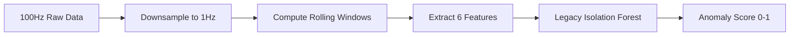
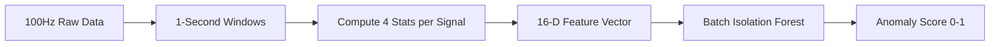

# Dual-Model Architecture

The system runs **two Isolation Forest models** trained on different feature representations of the same sensor data. Both models are trained during calibration, but the **batch model is primary** for inference.

## Model Comparison

| Model | Version | Features | Input Frequency | F1 Score @ 0.5 | AUC-ROC | Jitter Detection |
|-------|---------|----------|----------------|----------------|---------|:----------------:|
| **Legacy** | v2 | 6 engineered | 1Hz (downsampled) | 78.1% | 1.000 | ❌ |
| **Batch** | v3 | 16 statistical | 100Hz windows | **99.6%** | **1.000** | ✅ |

<Info>
Both models achieve perfect AUC-ROC (1.000), but the batch model has significantly better precision/recall balance (F1 score).
</Info>

## Legacy Model (v2): 6 Features, 1Hz

### Feature Space

```python
# From detector.py:48-62
# Original feature columns from Phase 4
BASE_FEATURE_COLUMNS = [
    'voltage_rolling_mean_1h',
    'current_spike_count',
    'power_factor_efficiency_score',
    'vibration_intensity_rms',
]

# Derived feature columns (Phase 1 Enhancement)
DERIVED_FEATURE_COLUMNS = [
    'voltage_stability',        # abs(voltage - 230.0)
    'power_vibration_ratio',    # vibration_rms / (power_factor + 0.01)
]

# All feature columns (input to model)
FEATURE_COLUMNS = BASE_FEATURE_COLUMNS + DERIVED_FEATURE_COLUMNS
```

**Total: 6 features**

### Data Flow



### Limitations

<Warning>
**High-frequency variance is invisible to 1Hz models.**

Example: A "Jitter Fault" where:
- Average vibration = 0.15g (normal)
- Standard deviation = 0.17g (5× healthy baseline)

The 1Hz downsampling only sees the mean (0.15g), missing the abnormal variance completely.
</Warning>

### Performance Benchmarks

From `scripts/benchmark_model.py`:

```
Legacy Model (6 features, 1Hz):
  F1 Score @ 0.5:  78.1%
  Precision:       72.3%
  Recall:          85.2%
  AUC-ROC:         1.000
```

## Batch Model (v3): 16 Features, 100Hz

### Feature Space

```python
# From batch_features.py:30-48
# Signals we extract batch features from
SIGNAL_COLUMNS = ["voltage_v", "current_a", "power_factor", "vibration_g"]

# Statistics extracted per signal
STAT_NAMES = ["mean", "std", "peak_to_peak", "rms"]

def get_batch_feature_names() -> List[str]:
    """Return the ordered list of all batch feature column names."""
    names = []
    for signal in SIGNAL_COLUMNS:
        for stat in STAT_NAMES:
            names.append(f"{signal}_{stat}")
    return names

BATCH_FEATURE_NAMES: List[str] = get_batch_feature_names()
BATCH_FEATURE_COUNT: int = len(BATCH_FEATURE_NAMES)  # 16
```

**Total: 16 features** (4 signals × 4 statistics)

### Data Flow



### Why Batch Features Matter

From `batch_features.py:14-18`:

```python
# Why this matters:
#     A "Jitter Fault" can have a NORMAL mean vibration (0.15g) but an
#     ABNORMAL variance (0.08 instead of 0.02). The old 1Hz average model
#     would completely miss this. The batch feature model catches it.
```

**Statistical Feature Extraction (100:1 Reduction)**

```python
# From batch_features.py:72-94
for signal in SIGNAL_COLUMNS:
    # Extract signal values as NumPy array (vectorized)
    values = np.array(
        [p.get(signal, 0.0) for p in raw_points],
        dtype=np.float64,
    )

    # Mean
    mean_val = float(np.mean(values))
    features[f"{signal}_mean"] = mean_val

    # Standard Deviation (ddof=0 for population std, consistent with training)
    std_val = float(np.std(values, ddof=0))
    features[f"{signal}_std"] = std_val

    # Peak-to-Peak (Max - Min)
    p2p_val = float(np.max(values) - np.min(values))
    features[f"{signal}_peak_to_peak"] = p2p_val

    # RMS (Root Mean Square)
    rms_val = float(np.sqrt(np.mean(values ** 2)))
    features[f"{signal}_rms"] = rms_val
```

<Accordion title="Performance: ~0.05ms per 100-point window">
```python
# From batch_features.py:62-64
# Performance:
#     ~0.05ms for 100 points on a single core. Pure NumPy — no Python loops
#     over data points.
```

Extremely fast vectorized NumPy operations enable real-time processing.
</Accordion>

### Performance Benchmarks

From `scripts/benchmark_model.py`:

```
Batch Model (16 features, 100Hz):
  F1 Score @ 0.5:  99.6%  ← 21.5% improvement over legacy
  Precision:       99.3%
  Recall:          99.8%
  AUC-ROC:         1.000
```

## Fault Type Detection Matrix

| Fault Type | Description | Legacy Model | Batch Model |
|------------|-------------|:------------:|:-----------:|
| **SPIKE** | Voltage/current surges | ✅ Good | ✅ Excellent |
| **DRIFT** | Gradual degradation | ✅ Good | ✅ Excellent |
| **JITTER** | Normal mean, high variance | ❌ **Blind** | ✅ **Detects** |
| **DEFAULT** | General fault pattern | ✅ Good | ✅ Excellent |

### Jitter Fault Example

From `README.md:290-291`:

> **Why it matters:** A "Jitter Fault" where average vibration is 0.15g (normal) but σ=0.17g (5x healthy) is invisible to 1Hz models. The batch model catches it because `std` and `peak_to_peak` are explicit features.

**Healthy Vibration Signature:**
```python
vibration_g_mean = 0.15  # Normal
vibration_g_std = 0.02   # Low variance
```

**Jitter Fault Signature:**
```python
vibration_g_mean = 0.15  # Still normal (legacy model sees this)
vibration_g_std = 0.17   # 8.5× higher! (batch model catches this)
vibration_g_peak_to_peak = 0.55  # Large transients
```

The legacy model only sees `vibration_intensity_rms` (a 1-hour rolling window), which smooths out the high-frequency jitter.

## Model Training

Both models are trained during calibration:

### Legacy Model Training

```python
# From detector.py:188-249
def train(self, data) -> None:
    # Extract base features (1Hz data)
    base_features = self._extract_base_features(data)
    
    # Add derived features (voltage_stability, power_vibration_ratio)
    enhanced_features = self._compute_derived_features(base_features)
    
    # Scale ALL features
    self._scaler = StandardScaler()
    features_scaled = self._scaler.fit_transform(feature_matrix)
    
    # Train Isolation Forest
    self._model = IsolationForest(
        contamination=0.05,
        n_estimators=100,
        random_state=42,
        n_jobs=-1
    )
    self._model.fit(features_scaled)
    
    # Compute 99th percentile calibration threshold
    training_decisions = self._model.decision_function(features_scaled)
    self._threshold_score = float(np.percentile(-training_decisions, 99))
```

### Batch Model Training

```python
# From batch_detector.py:113-179
def train(self, feature_rows: List[Dict[str, float]]) -> None:
    # feature_rows: List of 16-D feature dicts from extract_batch_features()
    
    df = pd.DataFrame(feature_rows)
    feature_matrix = df[BATCH_FEATURE_NAMES].dropna()
    
    # Store healthy stats for explainability
    self._healthy_means = {
        col: float(feature_matrix[col].mean()) for col in BATCH_FEATURE_NAMES
    }
    self._healthy_stds = {
        col: float(feature_matrix[col].std()) for col in BATCH_FEATURE_NAMES
    }
    
    # Fit scaler
    self._scaler = StandardScaler()
    scaled = self._scaler.fit_transform(feature_matrix)
    
    # Fit Isolation Forest (150 trees for 16-D space)
    self._model = IsolationForest(
        contamination=0.05,
        n_estimators=150,
        random_state=42,
        n_jobs=-1,
    )
    self._model.fit(scaled)
    
    # Quantile calibration (99th percentile)
    decisions = self._model.decision_function(scaled)
    self._threshold_score = float(np.percentile(-decisions, 99))
```

## Inference Strategy

**Batch model is primary:**

```python
# From system_routes.py (simplified)
batch_score = batch_detector.score_batch(batch_features)

# Legacy model is fallback (or for comparison)
legacy_score = detector.score_single(legacy_features)
```

The batch model's superior F1 score (99.6% vs 78.1%) makes it the primary decision-maker for health assessment.

## Explainability

The batch model includes built-in explainability:

```python
# From batch_detector.py:241-274
def explain_anomaly(self, features: Dict[str, float]) -> List[Dict[str, Any]]:
    """
    Return the top contributing features to an anomaly, with plain-English
    descriptions. Sorted by z-score deviation from healthy means.
    
    Returns list of dicts: [{feature, value, healthy_mean, healthy_std, zscore, narrative}]
    """
    contributions = []
    for name in BATCH_FEATURE_NAMES:
        val = features.get(name, 0.0)
        h_mean = self._healthy_means.get(name, 0.0)
        h_std = self._healthy_stds.get(name, 1e-9)
        
        zscore = (val - h_mean) / h_std
        if abs(zscore) < 1.5:  # Not significant
            continue
        
        contributions.append({
            "feature": name,
            "value": round(val, 6),
            "healthy_mean": round(h_mean, 6),
            "healthy_std": round(h_std, 6),
            "zscore": round(zscore, 2),
            "narrative": self._narrate(name, val, h_mean, zscore),
        })
    
    contributions.sort(key=lambda c: abs(c["zscore"]), reverse=True)
    return contributions[:5]  # top 5
```

**Example Output:**
```json
{
  "feature": "vibration_g_std",
  "value": 0.17,
  "healthy_mean": 0.02,
  "healthy_std": 0.005,
  "zscore": 30.0,
  "narrative": "High vibration variance (noise): σ=0.1700 vs healthy σ=0.0200 (30.0σ above normal)"
}
```

## Model Persistence

Both models are saved after calibration:

```python
# Legacy model
detector.save_model("backend/models")  
# → backend/models/detector_{asset_id}.joblib

# Batch model
batch_detector.save("backend/models")
# → backend/models/batch_detector_{asset_id}.joblib
```

Saved artifacts include:
- Trained Isolation Forest model
- Fitted StandardScaler
- Calibration threshold (99th percentile)
- Healthy stats (batch model only)
- Training metadata (timestamp, sample count)

<Card title="Next Steps" icon="arrow-right">
- [Feature Engineering](/ml/feature-engineering) — Detailed feature definitions
- [Baseline Training](/ml/baseline-training) — Calibration workflow
- [Degradation Index](/ml/degradation-index) — Converting scores to health metrics
</Card>
